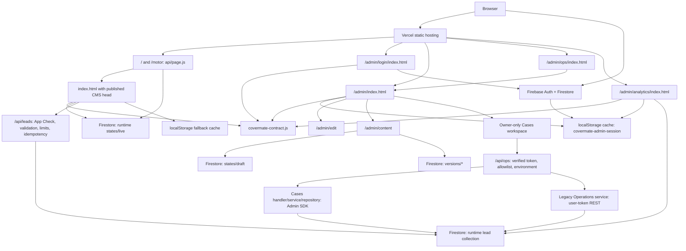

# CoverMate Architecture

Last updated: 2026-09-24. This document maps the current source. See
[HANDOFF.md](HANDOFF.md) for deployed versus candidate status and
[REFACTOR_20260924.md](REFACTOR_20260924.md) for refactor verification evidence.

## Current Shape

CoverMate uses a generated visitor bundle on Vercel. Its source lives in
`src/visitor/`; `scripts/generate-visitor-bundle.mjs` generates `index.html`
and `server/asset-versions.json`. The SEO implementation
serves `/` and `/motor` through `api/page.js`: it reads published CMS metadata
and replaces both initial document heads using `covermate-seo.mjs`. The visual
body remains client-rendered. Admin login/launcher remain static HTML; owner
editor routes use the same server wrapper without reading public/draft data.
See [SEO](SEO.md) for cache, outage, language and deployment boundaries.

The current visitor bundle is maintained against the product specs, repository docs, Firestore CMS contract, and owner-approved product decisions, including Firebase Auth/Firestore, Admin Analytics, private admin namespace routes, real lead submission paths, and the split between the home page plus the dedicated `/motor` campaign page.

Downloaded offline prototype HTML is not automatically portable. Some exports can depend on sidecar runtime files such as `support.js`, `image-slot.js`, and `_ds/*/_ds_bundle.js`; if those files are absent, the browser can render raw template placeholders like `{{ brandName }}`. Treat those files as historical references until they are compiled into self-contained HTML or shipped with a complete dependency folder.

Backend APIs use Vercel functions: `/api/ops/*`, `/api/analytics`, `/api/leads`
and `/api/telemetry`, plus `/api/page` and `/api/media`.
The media API uses signed Cloudinary uploads with a Free-plan quota guard;
see [CMS_MEDIA.md](CMS_MEDIA.md). Admin identity is
backed by Firebase Auth plus Firestore `admins/{uid}` allowlist checks, and CMS
content is Firestore-first through the active runtime namespace. The static
bundle keeps browser-local caches only as last-known fallback state.

## Source Surfaces

`src/visitor/*` owns the public visitor site and owner CMS modes, and generates
`index.html`:

- `/`
- `/motor`
- `/#motor`
- `/#life`
- `/#motor-focus`
- `/#life-focus`
- `/admin/edit`
- `/admin/content`
- `/admin/preview`
- `/admin/edit?page=motor`
- `/admin/content?page=motor`
- `/admin/preview?page=motor`

`src/visitor/shell.html` owns the outer shell, first-paint cloak, favicon/head
metadata, imports, and bundler-template slot. `src/visitor/template.html` owns
the embedded template. `src/visitor/defaults.js` owns default CMS config.
`src/visitor/runtime.js` owns rendering, route/mode state, normalization,
hydration, and DOM projection. `src/visitor/cms-controller.js` adds the owner
commands through `withCmsController`: queued draft persistence, save/publish,
reset, media actions, shortcuts, and edit history. `editor-history.js` owns the
bounded Draft snapshot history; it does not publish content. Use
`npm run build:visitor` to regenerate `index.html`; `npm run
check:visitor-source` verifies the generated artifact matches source.

`home.html` and `home.css` own the new Home projection, composed into the shared
template without replacing Motor. The generator compacts defaults, CSS, and
runtime code while keeping authored source readable. Performance and release
evidence belongs in HANDOFF and the release checks, not this ownership map.

Legacy incoming `/#edit`, `/#admin`, and `/#preview` remain session-gated for
compatibility, but current admin UI must generate `/admin/...` paths instead.

`/motor` is the dedicated motor-insurance campaign page in the same bundle. It
has its own local motor-page nav and canonical metadata while reusing shared
Firestore-backed insurer, tier, process, claim, renewal, guide, FAQ, contact,
and footer data. Home uses the public `/#motor` anchor for the unchanged
`insurers` DOM/CMS section; old `/#insurers` URLs normalize to `/#motor`.
The legacy `/#life` alias targets `#cover`. Both preserve the Home navbar.
`/#motor-focus` and `/#life-focus` are legacy unexposed variants and
must stay out of the header nav and sitemap.

`admin/login/index.html` owns the admin sign-in surface. Firebase Google sign-in
checks Firestore `admins/{uid}` before writing the browser-local
`covermate-admin-session` cache and redirecting to `/admin`.

`covermate-public.mjs` owns lightweight REST hydration of published CMS content
and lead submissions through `/api/leads`. Firebase Auth and Firestore SDKs are
not loaded for public first paint. App Check is loaded when a visitor submits.
`covermate-firebase-config.mjs` owns public Firebase identifiers and the strictly
loopback-only emulator switch. `covermate-roles.mjs` rejects unknown roles.

`covermate-firebase.js` owns admin Firebase SDK loading, Google popup sign-in,
Firestore admin allowlist checks, Firebase sign-out, live/draft hydration,
revision-checked draft saves, atomic publish/restore writes, version-history
reads, a compatibility delegate for lead submission, and admin lead reads.
Firestore paths come from
`covermate-environment.mjs`: production uses `sites/covermate/*` and
`contactLeads/*`, while UAT uses `sites/covermate-uat/*` and
`contactLeadsUat/*`. The visitor page loads only the live CMS state; owner
modes additionally load draft and versions.

`covermate-environment.mjs` owns runtime environment resolution. The exact
production host `covermateinsurance.com` always resolves to production, even if a
query string asks for UAT. Vercel preview hosts resolve to UAT automatically,
and local checks can opt in with `cm_env=uat`.

`covermate-contract.js` owns shared runtime constants and defensive helpers for
admin namespace routes, public page paths, owner path/hash detection, Admin
Portal module URLs, visible-section link filtering, repeatable item identity,
admin session storage, Firestore cache keys, state sanitization, and local
fallback caching. The visitor runtime, Firebase adapter, and source-authored
admin pages must consume this contract rather than duplicating storage keys,
route constants, section-link decisions, or session parsing.

`covermate-analytics.js` owns Google Analytics 4 visitor tracking for production
only. It uses measurement ID `G-5TF3C235EF`, loads only on
`covermateinsurance.com`, suppresses owner hashes and active admin sessions, and
never sends form field values or visitor contact details.

`admin/index.html` owns the private post-login Admin Portal Home. It is the
required hub shown before choosing Operations, Website content, Analytics,
Settings, public-site exit, or logout.

`admin/analytics/index.html` owns the private analytics dashboard. It is
source-authored rather than imported from an offline prototype, uses `admin/session.js` for
verified Firebase admin gating/sign-out, and uses `admin/analytics-data.js` to
normalize Firestore lead data. It does not load the visitor GA script.

`admin/session.js` and `admin/analytics-data.js` are source-level refactor seams
around the exported admin bundles. `admin/session.js` delegates storage/session
behavior to `covermate-contract.js`.

`admin/ops/index.html` is a compatibility shim into `/admin#operations`. It
must stay small and must not duplicate the Admin Portal sidebar, session gate,
or layout. `admin/ops/app.js` owns the private Operations Portal module mounted
by `admin/index.html`. It has no browser-seeded operations data and no local
workflow fallback. It obtains a Firebase ID token from the verified admin
session and calls `/api/ops/*`.

The visible Operations workspace mounts `admin/ops/cases.js` and `cases.css`
for owner-only Cases. Legacy Dashboard/Leads/Tasks/Audit render helpers and API
routes remain compatibility code, not current navigation tabs. Planned
Customers, Consultations, Quotes, Policies, Renewals, Documents, and Insurers
are hidden; their legacy endpoints retain `source: "not_wired"` responses.

`api/ops.js` owns the shared HTTP, Firebase ID-token, allowlist, environment,
rate-limit, and error boundary. `server/ops-access.cjs` owns role permissions.
It dispatches modern Cases and notification routes to
`server/cases-handler.cjs`, whose owner gate precedes service operations.
`server/cases-service.cjs` owns case commands/transactions and
`server/cases-repository.cjs` owns Admin SDK collection access. Legacy routes
use `server/legacy-ops-service.cjs` and the user-token Firestore REST adapter in
`server/ops-firestore.cjs`, preserving Rules enforcement and existing query
caps. The split does not introduce a storage migration or new index/query
behavior. See [ADMIN_CASES_V2.md](ADMIN_CASES_V2.md) for the canonical contract.

`assets/ins/*.png` owns insurer logo media for the motor-insurance logo section.
The exported reference also carries AIA/Srikrung Broker relationship-card logo
assets through the bundle runtime.

`organic.css` is the supplied organic design-system reference.

`scripts/smoke.mjs` owns the current Playwright smoke contract.

`scripts/lib/bundler-template.mjs` owns embedded bundle-template parsing,
marker restoration/masking, and serialization for maintenance scripts. Scripts
that read or rewrite `` strings appear inside the JSON script body.
Escaped `<\/script>` or `<\u002Fscript>` text is required so the browser does
not terminate the template early.

Do not add admin routes, hash aliases, draft/preview URLs, or owner modes to
`sitemap.xml`.

Do not enable direct public Firestore lead writes. `/api/leads` owns App Check,
allowlisted fields, limits, idempotency, and published consent-receipt validation.
Canonical Cases, activities, mutation receipts, and notifications are written
through their authorized server boundary, not browser Rules bypasses. Preserve
the production/UAT namespace and owner-only Cases gate.

`server/admin-notification.cjs` owns Resend system-inbox alerts: production-only
outbox intents created within intake transactions, post-commit dispatch,
idempotent bounded retries and an owner-only test. A protected
`api/notification-worker.js` and `server/admin-email-scheduler.cjs` add independent
retry, follow-up revision checks and daily overdue digests. Personal email
preferences remain unsupported. See
[ADMIN_EMAIL_NOTIFICATIONS.md](ADMIN_EMAIL_NOTIFICATIONS.md).

CSP is enforced with the renderer's documented inline/eval/blob allowances.
Do not confuse this with a strict nonce/hash policy, or revert it to Report-Only
because of older notes. Consult `vercel.json` and `NFR_HARDENING.md`.

## Future Architecture Options

These are proposals, not current implementation.

Server-backed CMS authentication/persistence and signed Cloudinary media uploads
already exist. Keep future provider changes behind the media adapter; they do
not require rebuilding Auth or migrating Firestore.

For maintainability, migrate the exported HTML bundles into source components
while preserving current product decisions and using historical references only as optional visual fixtures.

For insurer-count copy, keep the visible 14-logo comparison grid plus
AIA/Srikrung relationship proof cards aligned with the supplied reference unless
the business owner supplies new insurer assets or revised copy.

For paid traffic, have the business owner review all license, broker, OIC,
contact, and insurance claim copy.
