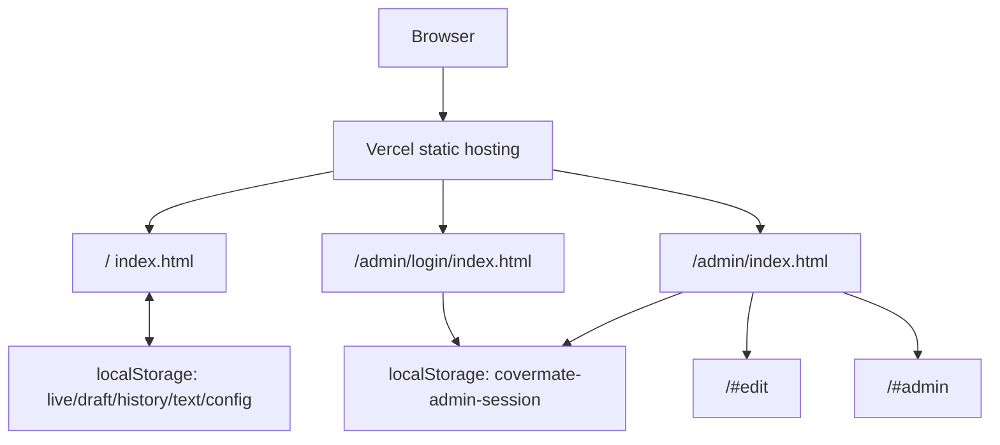

# CoverMate Architecture

Last updated: 2026-07-28

## Current Shape

CoverMate is a Vercel-hosted static export. The visitor site and owner/admin
tools are bundled into HTML files generated from Claude Design `.dc.html`
references, with small production patches applied in the wrapper and embedded
bundle strings.

There is no backend API, server-side auth, database, or remote CMS in this repo.
Admin/session/content state is browser-local.

## Source Surfaces

`index.html` owns the public visitor site and owner hash modes:

- `/`
- `/#motor`
- `/#edit`
- `/#admin`
- `/#preview`

`admin/login/index.html` owns the admin sign-in surface. Demo/Google sign-in
writes `covermate-admin-session` and redirects to `/admin`.

`admin/index.html` owns the private post-login launcher. It is the required
"Manage your site" page shown before choosing inline editing or the control
panel.

`assets/ins/*.png` owns insurer logo media for the motor-insurance logo section.
The exported reference also carries AIA/Srikrung Broker relationship-card logo
assets through the bundle runtime.

`organic.css` is the supplied organic design-system reference.

`scripts/smoke.mjs` owns the current Playwright smoke contract.

`vercel.json` owns clean URLs and static cache behavior.

## Runtime Data

The app stores admin and CMS-like state in `localStorage`. See
[DATA_CONTRACT.md](DATA_CONTRACT.md) for the key
contract and migration rules.

Because this storage is browser-local:

- edits do not sync across devices
- clearing browser data removes draft/live local state
- the session gate is prototype behavior, not real backend authorization

## Deployment

Production URL:

[https://covermate.vercel.app](https://covermate.vercel.app)

The release process is documented in
[RELEASE_RUNBOOK.md](RELEASE_RUNBOOK.md).

## Boundaries

The visitor surface owns public content, public layout, language toggle,
insurance sections, lead/contact UI, and owner hash-mode rendering.

The admin login surface owns only session entry and post-login redirect.

The admin launcher owns post-login choice architecture. It should not be skipped
after login.

The `/#admin` hash mode owns the actual control panel for sections, content,
brand/chrome, theme/data, export, restore, draft, preview, and publish behavior.

The owner hash modes also own the admin continuation UI:

- closing the `/#admin` drawer removes the hash and shows a compact owner bar
  instead of trapping the owner on a public page with no way back;
- `/#edit` shows its own owner toolbar for returning to the control panel,
  returning to `Main` (`/admin`), ending edit mode, or logging out;
- sign out clears both `covermate-admin-session` and the admin-ever marker, then
  returns to `/admin/login`.

Visible Admin chrome/action labels are English-only. The stable owner labels are
`Panel`, `Edit text`, `Main`, `Done`, `Save draft`, `Preview`, `Publish`,
`Success`, and `Log out`.

The mobile interaction contract is enforced by a template-level
`covermate-responsive-touch-policy` patch on all three HTML surfaces. It keeps
buttons, form fields, drawer actions, owner bars, and navigation/footer links at
44px-class touch targets on narrow or coarse-pointer devices.

## Do Not Break

Do not rename localStorage keys without a migration.

Do not redirect successful login directly to `/#admin`; keep `/admin` as the
post-login launcher.

Do not remove the early `/admin/login` session gate from `/admin`.

Do not remove the splash-hiding rules for `#__bundler_thumbnail` and
`#__bundler_loading`.

Do not remove the `covermate-template-cloak` rules that hide raw `<x-dc>`
template content before hydration on visitor and admin pages.

Do not remove the owner reopen bar after the admin drawer closes. It must keep
reopen `Panel`, `Edit text`, `Main`, and `Log out` actions reachable.

Do not reintroduce an ambiguous drawer-header-only sign-out button. Sign-out
must remain reachable from `/admin`, the `/#admin` owner tools, and the `/#edit`
owner toolbar.

Do not reduce mobile controls below 44px-class touch targets.

Do not remove the Google Sans family font policy from any visitor or admin
surface. Body/UI/form text should stay on Google Sans/Google Sans Thai in both
Thai and English; headings/logo text may use the display face only when it stays
visually aligned with that stack.

Do not edit JSON inside `` strings appear inside the JSON script body.
Escaped `<\/script>` or `<\u002Fscript>` text is required so the browser does
not terminate the template early.

## Future Architecture Options

These are proposals, not current implementation.

For a real production CMS, add server-backed auth and persistence.

For maintainability, migrate the exported HTML bundles into source components
while keeping the `.dc.html` references as visual fixtures.

For the "26+" insurer claim, keep the visible 14-logo comparison grid plus
AIA/Srikrung relationship proof cards aligned with the supplied reference unless
the business owner supplies new insurer assets or revised copy.

For paid traffic, have the business owner review all license, broker, OIC,
contact, and insurance claim copy.
