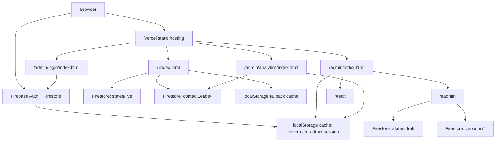

# CoverMate Architecture

Last updated: 2026-07-31

## Current Shape

CoverMate is a Vercel-hosted static export. The visitor site and owner/admin
tools are bundled into HTML files generated from Claude Design `.dc.html`
references, with small production patches applied in the wrapper and embedded
bundle strings.

The current visitor bundle has been reconciled against
`/Users/point/Downloads/CoverMate Standalone (open this) (1).html` while
preserving production product decisions that intentionally differ from that
offline demo, including Firebase Auth/Firestore, Admin Analytics, and the
single-page `#motor` anchor alias.

There is no backend API in this repo. Admin identity is backed by Firebase Auth
plus Firestore `admins/{uid}` allowlist checks, and CMS content is
Firestore-first through `sites/covermate/*` documents. The static bundle keeps
browser-local caches only as last-known fallback state.

## Source Surfaces

`index.html` owns the public visitor site and owner hash modes:

- `/`
- `/#motor`
- `/#edit`
- `/#admin`
- `/#preview`

`/#motor` is currently an alias into the main site, re-aimed to the `#insurers`
section after hydration while preserving the global navbar. The earlier focused
motor landing-page variant is still present in the bundle but hidden behind
`ENABLE_MOTOR_VARIANT = false`.

`admin/login/index.html` owns the admin sign-in surface. Firebase Google sign-in
checks Firestore `admins/{uid}` before writing the browser-local
`covermate-admin-session` cache and redirecting to `/admin`.

`covermate-firebase.js` owns Firebase SDK loading, Google popup sign-in,
Firestore admin allowlist checks, Firebase sign-out, live/draft hydration,
draft saves, publish/restore writes, version-history reads, public lead
submission, and admin lead reads. The visitor page loads only the live CMS
state; owner modes additionally load draft and versions.

`covermate-analytics.js` owns Google Analytics 4 visitor tracking for production
only. It uses measurement ID `G-5TF3C235EF`, loads only on
`covermate.vercel.app`, suppresses owner hashes and active admin sessions, and
never sends form field values or visitor contact details.

`admin/index.html` owns the private post-login launcher. It is the required
"Manage your site" page shown before choosing inline editing, the control
panel, or analytics.

`admin/analytics/index.html` owns the private analytics dashboard. It is
source-authored rather than a Claude Design export, uses `admin/session.js` for
session gating/sign-out, and uses `admin/analytics-data.js` to normalize
Firestore lead data. It does not load the visitor GA script.

`admin/session.js` and `admin/analytics-data.js` are the first source-level
refactor seam around the exported admin bundles.

`assets/ins/*.png` owns insurer logo media for the motor-insurance logo section.
The exported reference also carries AIA/Srikrung Broker relationship-card logo
assets through the bundle runtime.

`organic.css` is the supplied organic design-system reference.

`scripts/smoke.mjs` owns the current Playwright smoke contract.

`favicon.svg` and `favicon.ico` own the CoverMate browser icons. `vercel.json`
owns clean URLs and static cache behavior.

`robots.txt`, `sitemap.xml`, `site.webmanifest`, and `assets/covermate-og.*`
own the static SEO/crawler/social-preview layer. The public page also carries
SEO metadata in both the outer shell head and the embedded template head.

## Runtime Data

The app treats Firestore as the source of truth for CMS state:

- public render: hydrate `sites/covermate/states/live`
- owner edit/control modes: hydrate `states/live`, `states/draft`, and
  `versions/*`
- save draft: write `states/draft`
- publish or restore: atomically write `states/live`, `states/draft`, and a new
  version document
- visitor lead submit: create a validated `contactLeads/*` document
- admin analytics: read `contactLeads/*`; GA4 traffic metrics require a future
  server-side Data API endpoint or Firestore export

`localStorage` stores last-known copies of live/draft/text/history so the static
bundle can render a fallback if Firestore is unreachable. A successful remote
read always rewrites the local cache before the embedded app reads it; hard-coded
defaults are cold-start fallback only. Admin sign-in is Firebase backed, but
`/admin` and owner hash modes also consume the approved
`covermate-admin-session` cache for fast static routing. See
[DATA_CONTRACT.md](DATA_CONTRACT.md) for the full contract.

Runtime config is normalized after Firestore/local reads to fill newly added
sections and fields that older live documents do not yet contain. This
normalization is additive only: it fills missing structure, preserves existing
live/draft values, and must not replace admin-edited remote content with bundled
fallback copy.

After the embedded app reads hydrated live content, it syncs SEO title,
description, Open Graph/Twitter tags, canonical URL, robots meta, `html[lang]`,
and `script#covermate-jsonld` from the current live state. Static metadata is
only the non-rendering crawler/link-preview fallback.

## Deployment

Production URL:

[https://covermate.vercel.app](https://covermate.vercel.app)

The release process is documented in
[RELEASE_RUNBOOK.md](RELEASE_RUNBOOK.md).

## Boundaries

The visitor surface owns public content, public layout, language toggle,
insurance sections, lead/contact UI, and owner hash-mode rendering.

The admin login surface owns only session entry and post-login redirect.

The admin launcher owns post-login choice architecture. It should not be skipped
after login.

The private analytics page owns owner-only reporting for lead capture, funnel
readiness, lead mix, recent leads, and GA4 Data API connection state.

The `/#admin` hash mode owns the actual control panel for sections, content,
brand/chrome, theme/data, export, restore, draft, preview, and publish behavior.

The owner hash modes also own the admin continuation UI:

- closing the `/#admin` drawer removes the hash and shows a compact owner bar
  instead of trapping the owner on a public page with no way back;
- `/#edit` shows its own owner toolbar for returning to the control panel,
  returning to `Main` (`/admin`), ending edit mode, or logging out;
- sign out clears both `covermate-admin-session` and the admin-ever marker, then
  returns to `/admin/login`.

Visible Admin chrome/action labels are English-only. The stable owner labels are
`Panel`, `Edit text`, `Main`, `Done`, `Save draft`, `Preview`, `Publish`,
`Success`, and `Log out`.

The mobile interaction contract is enforced by a template-level
`covermate-responsive-touch-policy` patch on all three HTML surfaces. It keeps
buttons, form fields, drawer actions, owner bars, and navigation/footer links at
44px-class touch targets on narrow or coarse-pointer devices.

## Do Not Break

Do not rename localStorage keys without a migration.

Do not let local defaults, one-off local migrations, or stale localStorage cache
override a successfully hydrated Firestore live document.

Do not let static SEO fallbacks, stale localStorage, or placeholder contact
fields override live SEO metadata or structured data after Firestore hydration.

Do not add Google Analytics to `/admin`, `/admin/login`, or `/admin/analytics`,
and do not send visitor names, phone numbers, LINE IDs, emails, or message text
as Analytics event parameters.

Do not redirect successful login directly to `/#admin`; keep `/admin` as the
post-login launcher.

Do not remove the early `/admin/login` session gate from `/admin`.

Do not remove the splash-hiding rules for `#__bundler_thumbnail` and
`#__bundler_loading`.

Do not remove the `covermate-template-cloak` rules that hide raw `<x-dc>`
template content before hydration on visitor and admin pages.

Do not remove the owner reopen bar after the admin drawer closes. It must keep
reopen `Panel`, `Edit text`, `Main`, and `Log out` actions reachable.

Do not reintroduce an ambiguous drawer-header-only sign-out button. Sign-out
must remain reachable from `/admin`, the `/#admin` owner tools, and the `/#edit`
owner toolbar.

Do not reduce mobile controls below 44px-class touch targets.

Do not remove the Google Sans family font policy from any visitor or admin
surface. Headings, logo text, body/UI/form text, admin tools, analytics, and
English/Thai copy should stay on Google Sans first, with Google Sans Thai and
Noto Sans Thai as script fallbacks.

Do not edit JSON inside `` strings appear inside the JSON script body.
Escaped `<\/script>` or `<\u002Fscript>` text is required so the browser does
not terminate the template early.

Do not add admin routes, hash aliases, draft/preview URLs, or owner modes to
`sitemap.xml`.

Do not relax `contactLeads/*` public create rules without preserving explicit
field allowlists, length caps, `status == "new"`, `read == false`, and server
timestamp validation.

Do not enforce CSP until the generated bundle's inline script/style/blob
requirements are removed or explicitly hashed. Current CSP is Report-Only.

## Future Architecture Options

These are proposals, not current implementation.

For a real production CMS, add server-backed auth and persistence.

For maintainability, migrate the exported HTML bundles into source components
while keeping the `.dc.html` references as visual fixtures.

For the "26+" insurer claim, keep the visible 14-logo comparison grid plus
AIA/Srikrung relationship proof cards aligned with the supplied reference unless
the business owner supplies new insurer assets or revised copy.

For paid traffic, have the business owner review all license, broker, OIC,
contact, and insurance claim copy.
