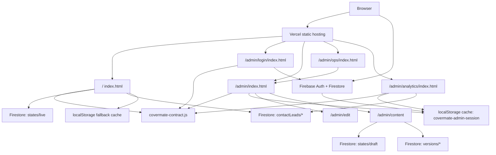

# CoverMate Architecture

Last updated: 2026-08-20

## Current Shape

CoverMate is a Vercel-hosted static export. The visitor site and owner/admin
tools are bundled into HTML files generated from Claude Design `.dc.html`
references, with small production patches applied in the wrapper and embedded
bundle strings.

The current visitor bundle has been reconciled against
`/Users/point/Downloads/CoverMate Standalone.html`,
`/Users/point/Downloads/CoverMate Standalone BUILD SOURCE (do not open).dc.html`,
and `SPEC (5)` while
preserving production product decisions that intentionally differ from offline
demos, including Firebase Auth/Firestore, Admin Analytics, private admin
namespace routes, real lead submission paths, and the one-page `#motor` alias
behavior.

Downloaded Claude HTML is not automatically a portable standalone. Some exports
still depend on sidecar runtime files such as `support.js`, `image-slot.js`, and
`_ds/*/_ds_bundle.js`; if those files are absent, the browser can render raw
template placeholders like `{{ brandName }}`. Treat those files as design
references until they are compiled into self-contained HTML or shipped with a
complete dependency folder.

There is now one narrow backend API in this repo: `/api/ops/*`, deployed as a
Vercel serverless function for the private Operations Portal. Admin identity is
backed by Firebase Auth plus Firestore `admins/{uid}` allowlist checks, and CMS
content is Firestore-first through `sites/covermate/*` documents. The static
bundle keeps browser-local caches only as last-known fallback state.

## Source Surfaces

`index.html` owns the public visitor site and owner CMS modes:

- `/`
- `/#motor`
- `/#life`
- `/#motor-focus`
- `/#life-focus`
- `/admin/edit`
- `/admin/content`
- `/admin/preview`

Legacy incoming `/#edit`, `/#admin`, and `/#preview` remain session-gated for
compatibility, but current admin UI must generate `/admin/...` paths instead.

`/#motor` and `/#life` are aliases into the main site, re-aimed to `#insurers`
and `#cover` after hydration while preserving the global navbar.
`/#motor-focus` and `/#life-focus` render unexposed campaign variants from the
latest reference and must stay out of the header nav and sitemap.

`admin/login/index.html` owns the admin sign-in surface. Firebase Google sign-in
checks Firestore `admins/{uid}` before writing the browser-local
`covermate-admin-session` cache and redirecting to `/admin`.

`covermate-firebase.js` owns Firebase SDK loading, Google popup sign-in,
Firestore admin allowlist checks, Firebase sign-out, live/draft hydration,
draft saves, publish/restore writes, version-history reads, public lead
submission, and admin lead reads. The visitor page loads only the live CMS
state; owner modes additionally load draft and versions.

`covermate-contract.js` owns shared runtime constants and defensive helpers for
admin namespace routes, owner path/hash detection, admin session storage,
Firestore cache keys, state sanitization, and local fallback caching. The
visitor shell, Firebase adapter, and source-authored admin pages must consume
this contract rather than duplicating storage keys, route constants, or session
parsing.

`covermate-analytics.js` owns Google Analytics 4 visitor tracking for production
only. It uses measurement ID `G-5TF3C235EF`, loads only on
`covermate.vercel.app`, suppresses owner hashes and active admin sessions, and
never sends form field values or visitor contact details.

`admin/index.html` owns the private post-login Admin Portal Home. It is the
required hub shown before choosing Operations, Website content, Analytics,
Settings, public-site exit, or logout.

`admin/analytics/index.html` owns the private analytics dashboard. It is
source-authored rather than a Claude Design export, uses `admin/session.js` for
verified Firebase admin gating/sign-out, and uses `admin/analytics-data.js` to
normalize Firestore lead data. It does not load the visitor GA script.

`admin/session.js` and `admin/analytics-data.js` are source-level refactor seams
around the exported admin bundles. `admin/session.js` delegates storage/session
behavior to `covermate-contract.js`.

`admin/ops/index.html` is a compatibility shim into `/admin#operations`. It
must stay small and must not duplicate the Admin Portal sidebar, session gate,
or layout. `admin/ops/app.js` owns the private Operations Portal module mounted
by `admin/index.html`. It has no browser-seeded operations data and no local
workflow fallback. It obtains a Firebase ID token from the verified admin
session and calls `/api/ops/*`.

`api/ops.js` owns Operations Portal backend reads and writes on Vercel. It
verifies the Firebase ID token, checks the Firestore `admins/{uid}` allowlist,
applies role permissions server-side, reads `contactLeads/*`, and writes lead
status, timeline, task, follow-up, and per-lead audit state back to Firestore.
Customers, Consultations, Quotes, Policies, Renewals, Documents, and Insurers
currently return `source: "not_wired"` metadata, so the UI displays an explicit
not-wired state instead of browser-seeded or fake records.

`assets/ins/*.png` owns insurer logo media for the motor-insurance logo section.
The exported reference also carries AIA/Srikrung Broker relationship-card logo
assets through the bundle runtime.

`organic.css` is the supplied organic design-system reference.

`scripts/smoke.mjs` owns the current Playwright smoke contract.

`scripts/lib/bundler-template.mjs` owns embedded Claude bundle-template parsing,
marker restoration/masking, and serialization for maintenance scripts. Scripts
that read or rewrite `` strings appear inside the JSON script body.
Escaped `<\/script>` or `<\u002Fscript>` text is required so the browser does
not terminate the template early.

Do not add admin routes, hash aliases, draft/preview URLs, or owner modes to
`sitemap.xml`.

Do not relax `contactLeads/*` public create rules without preserving explicit
field allowlists, length caps, `status == "new"`, `read == false`, and server
timestamp validation.

Do not enforce CSP until the generated bundle's inline script/style/blob
requirements are removed or explicitly hashed. Current CSP is Report-Only.

## Future Architecture Options

These are proposals, not current implementation.

For a real production CMS, add server-backed auth and persistence.

For maintainability, migrate the exported HTML bundles into source components
while keeping the `.dc.html` references as visual fixtures.

For insurer-count copy, keep the visible 14-logo comparison grid plus
AIA/Srikrung relationship proof cards aligned with the supplied reference unless
the business owner supplies new insurer assets or revised copy.

For paid traffic, have the business owner review all license, broker, OIC,
contact, and insurance claim copy.
