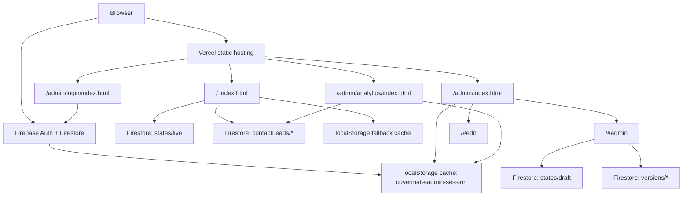

# CoverMate Claude CMS/Admin Feedback Packet

Last updated: 2026-08-03

Use this single file when Claude Design cannot access the project folder. It contains the full prompt plus the Markdown project documents Claude must treat as input.

## Claude Task

You are updating the CoverMate design handoff / standalone artifact for implementation by Codex. Your job is not only visual polish. You must reconcile the design with the real production product contract and return a CMS-aware, implementation-ready Markdown handoff.

## Source-Of-Truth Order

When sources disagree, use this order:

1. Latest explicit owner request.
2. Existing production docs embedded in this packet.
3. Current production behavior at https://covermate.vercel.app.
4. Claude standalone/spec artifacts as visual references only.

Do not silently override production decisions. If a recommendation conflicts with this packet, classify it as `reject` or `needs owner decision`.

## Product Decisions To Preserve

- Visitor site and Admin must be the same product, not separate websites.
- `#motor` is an anchor/alias inside the same visitor page, not a standalone sub-site.
- Visitor reads only published content. Admin edits draft content. Preview shows draft.
- `Public site` opens a separate clean visitor tab. The current admin tab stays in owner mode.
- Admin `X` and edit `Close` return to the private `/admin` launcher, not the visitor page. Admin dock/panel must never appear on normal visitor mode just because the browser is signed in.
- Do not reintroduce an owner reopen bar on the public visitor route. Older embedded notes that mention an in-session reopen bar or `/?view=public` are superseded by this decision.
- Draft preview is a private owner route at `/#preview`. It shows the draft page with only a top dark preview bar: `Draft preview · visitors don’t see this until you publish`, plus `Open editor` and `Publish`. It must not show the edit dock or admin drawer.
- Admin menu/action labels should be English: `Main`, `Public site`, `Save draft`, `Preview`, `Publish`, `Log out`.
- Body font should be Google Sans / Google Sans Thai across Thai and English. Heading/logo fonts may differ only if visually compatible.
- Existing component alignment/product decisions must remain unless explicitly changed, including centered calculator cards, centered insurer identity headers, single non-duplicated nav labels, non-clipping fee cards, and one-line desktop contact heading.
- Do not emit raw template syntax such as `{{ value }}`, `[object Object]`, `sc-if`, `sc-for`, or demo unpacking UI in rendered standalone files.

## Current Implementation Overrides

These overrides reflect the 2026-08-03 production implementation pass and supersede any contradictory embedded historical notes below.

- Clean public exit now uses `/` directly, with owner markers cleared. Do not design or implement `/?view=public` as the visible owner-exit mechanism.
- A signed-in admin session is permission state only, not a visible public-page mode.
- The normal public visitor route must have zero `[data-admin-owner-bar]`, zero admin drawer, and no visible `Admin portal`, `Text edit`, `Save draft`, or `Publish` action copy.
- `/#preview` may show `Publish`, but only inside the top draft-preview bar. `/#preview` must not show the owner dock, edit toolbar, admin section drawer, or screen switcher.
- Section rows in the admin control panel should use owner-readable metadata: human section title, group/status/count summary, `Edit content`, and collapsed `Advanced layout`.
- Raw `cols` controls are not primary CMS IA. If retained, place them under Advanced and label them as `Cards per row` or `Desktop table width`.
- Repeatable content visibility is `on !== false`; hidden items/cards/heads remain editable in Admin but are omitted from the visitor render.
- Add operations should create visible records by default: new `items`, `cards`, and tier `heads` must include `on: true`.

## CMS/Admin Feedback To Apply

The admin experience should become a real CMS, not a developer layout editor. Add a clear CMS contract covering:

- Editable fields per section.
- `draft` vs `published` state.
- Thai/English content separation.
- Repeatable collections: cards, FAQs, insurer logos, testimonials, steps, coverage tiers, calculator options.
- Stable item IDs for repeatable data; do not rely only on array index.
- Media fields: image/logo URL, alt text, replace/upload state, empty state.
- SEO fields: title, meta description, OG title/description/image, canonical, structured data notes.
- Contact/lead fields: form labels, topic options, coverage options, consent copy, success/error states.
- Analytics page: GA4 status, leads, conversion, source/channel, device, date range, Firestore/GA4 data provenance.

## Publish Flow Requirements

Design the admin publishing system as a real workflow:

- `Save draft`
- `Preview`
- `Publish`
- Custom confirm modal before save/publish, not browser confirm.
- Toast after success/error.
- Toast has close `x`.
- Toast has `Undo` for 30 seconds where feasible.
- Show timestamps/status such as `Draft saved`, `Published`, `Unsaved changes`.
- Publish should make the visitor page update from the latest published state.

## Control Panel IA Redesign

The current Control Panel exposes implementation details such as raw section IDs, `cols`, `bg • bg`, and unexplained alignment icons. Redesign it as an owner-friendly CMS.

Recommended model:

1. Main Control Panel = `Site structure`
   - Human-readable section names.
   - Short descriptions of what each section does.
   - Visibility toggle.
   - Reorder controls.
   - Status/count summary, e.g. `4 items`, `6 logos`, `5 FAQs`.
   - `Edit` button for section-specific editing.

2. Section Editor = detailed CMS editor
   - Add/remove/reorder cards or rows.
   - Edit copy, icons, logos, labels, links, alt text.
   - Adjust section-specific layout only where meaningful.
   - Show preview or small location indicator.

3. Advanced Layout = optional/collapsed
   - Hide implementation details here.
   - Rename `cols` to owner-friendly language such as `Cards per row`, `Desktop layout`, or presets: `Compact`, `Balanced`, `Wide`.
   - Explain that mobile remains one column where applicable.
   - Rename background tokens to visual choices with swatches: `Cream`, `Soft green`, `Dark brown`, etc.

Avoid internal labels as primary labels. Use owner-readable Thai/English labels.

Examples:

- Instead of `Trust chips #trust`: `แถบความน่าเชื่อถือ` / `Short proof points under hero`.
- Instead of `Cover cards #cover`: `ประเภทความคุ้มครอง` / `Insurance coverage cards`.
- Instead of `Policy review #review`: `รีวิวกรมธรรม์` / `Policy review explanation`.
- Instead of `cols 4`: `Cards per row: 4` or `Desktop layout: 4 cards`.

## Required Claude Output

Return a Markdown handoff with these sections:

1. Product Decision Review
   - Table: item, recommendation, adopt/adapt/reject/needs owner decision, rationale, risk.

2. CMS Data Model
   - Section-by-section editable fields.
   - Draft/published shape.
   - Repeatable collection schemas.
   - Media/SEO/contact/analytics fields.

3. Admin IA Redesign
   - Admin home.
   - Owner dock.
   - Site structure panel.
   - Section editor.
   - Advanced layout.
   - Publish/preview/save states.

4. Component Map
   - Visitor components.
   - Admin components.
   - Editable fields per component.
   - Add/remove/reorder behavior.

5. Interaction State Matrix
   - Default, hover, focus, loading, saving, saved, error, disabled, confirm, undo, empty states.

6. Responsive Behavior
   - Desktop/tablet/mobile.
   - Admin dock collapsed/expanded behavior.
   - Control panel mobile behavior.
   - No overflow/clipping.

7. Acceptance Checklist
   - Visitor never shows admin UI.
   - Published visitor content matches latest publish.
   - Draft edits do not leak until preview/publish.
   - Section labels are understandable without knowing code.
   - Add/remove/reorder works for repeatable content.
   - No raw template syntax appears.
   - No duplicate nav.
   - Font consistency holds across Thai and English.

## Embedded Project Documents

The following documents are embedded verbatim. Treat them as required input.


---

# Embedded: docs/CLAUDE_FEEDBACK_SPEC2_CONFLICTS.md

Purpose: Mandatory production conflict ledger and micro-layout decisions

```markdown
# CoverMate Claude Feedback: SPEC 2 / Handoff Conflicts

Last updated: 2026-08-03

Purpose: this is a direct feedback note for Claude Design before producing the
next CoverMate standalone or design update. It reconciles the latest Claude
handoff package with the real production product decisions in this repository.

## Artifacts Studied

- `/Users/point/Downloads/SPEC (2).md`
  - SHA-256:
    `63e566124316e7bddb8a472a75acf95866acc008fd8e6cfd9de6e3a186c0d81d`
- `/Users/point/Downloads/CoverMate Standalone (2).html`
  - SHA-256:
    `cd877fc02501b7933d98f8c77ffcffe8820a2ebcfd050bc5a202a292ee46683d`
- `/Users/point/Downloads/CoverMate Handoff.zip`
  - SHA-256:
    `a64ad69ca885f8fdfd2bcc62fe12d4adbbe65f23c420dd59f2d59a02408d1787`
- Existing production/product docs:
  - `/Users/point/CoverMate/docs/covermate-website-full-design-spec.md`
  - `/Users/point/CoverMate/docs/CLAUDE_DESIGN_RECONCILIATION.md`
  - `/Users/point/CoverMate/docs/DATA_CONTRACT.md`
  - `/Users/point/CoverMate/docs/INTERACTION_MAP.md`
  - `/Users/point/CoverMate/docs/ARCHITECTURE.md`

Rendered standalone check:

- The latest standalone hydrates successfully in Chrome.
- No visible raw `{{ ... }}`, `sc-if`, `sc-for`, `x-dc`, `[object Object]`,
  or settled `Unpacking...` leak was found in the DOM.
- `#motor` and `#insurers` scroll to the same motor-insurer section.
- Body and H1 computed font stacks resolve to Google Sans / Google Sans Thai.
- Known issue: opening the standalone from `file://` still logs a
  `.image-slots.state.json` fetch error. Treat this as a portability issue to
  clean up in future exports.

## Source-Of-Truth Order

Use this order when sources disagree:

1. Latest explicit owner request.
2. Production product decisions documented in `/Users/point/CoverMate/docs`.
3. Current production behavior at `https://covermate.vercel.app`.
4. `/Users/point/Downloads/SPEC (2).md` and the extracted handoff package.
5. `/Users/point/Downloads/CoverMate Standalone (2).html` as visual evidence
   only where it does not conflict with the product decisions above.

Claude standalone/design exports are reference artifacts. They must not override
production auth, Firestore paths, publish behavior, analytics privacy,
SEO/indexing, admin routing, or already-accepted component placement decisions.

## Hard Conflicts To Fix Before The Next Claude Export

| Area | Handoff / Claude source | Production decision | Required Claude correction |
| --- | --- | --- | --- |
| Architecture | SPEC recommends Next.js App Router and API routes. | Current production is a static Vercel bundle with Firebase helpers. | Treat Next.js/API as future refactor guidance, not a reason to remove current static production behavior. |
| Firestore rules | `handoff/firestore.rules` uses `owner@example.com`, `/leads`, `/renewals`, and `/site/{doc}`. | Production uses Firebase Auth plus Firestore `admins/{uid}`, `sites/covermate/states/live`, `sites/covermate/states/draft`, `sites/covermate/versions/*`, and `contactLeads/*`. | Do not apply handoff rules directly. Generate future rules against the production data contract unless the backend refactor is explicitly approved. |
| Lead schema | SPEC/handoff target uses `leads/{id}` with consent/source/intent fields. | Production public forms write validated `contactLeads/{leadId}` with `qtype`, `coverage`, `summary`, `sourcePath`, `consent`, status/read timestamps. | If updating forms, preserve `contactLeads/*` until a planned migration exists. |
| Admin allowlist | Handoff rules contain an email allowlist placeholder. | Production allowlist is Firestore document ID by Firebase UID: `admins/{uid}` with `active: true`. | Never ship `owner@example.com` or email-only rules. |
| Fonts | `handoff/theme/organic.css` still imports Caprasimo/Figtree and has negative heading tracking. `handoff/src/theme.ts` still includes Figtree fallback. | Product decision: Google Sans family everywhere, both Thai and English; no Caprasimo, Chonburi, Figtree, or unrelated display/body fonts. | Remove stale font imports/tokens from future exports. Do not rely on Codex patching computed output afterward. |
| Letter spacing | Handoff organic CSS contains `letter-spacing: -0.015em`. | No negative tracking anywhere. Small-caps/kickers may use positive tracking only. | Set headings to `letter-spacing: 0`. |
| Spacing tokens | SPEC says there is no `--space-5` or `--space-7`; using them caused layout drops. Some generated Organic CSS still includes `--space-5`. | Production docs treat undefined spacing tokens as a bug class. | Use only the approved scale and run a grep/test for invalid custom properties. |
| Validator shape | `handoff/src/validate.ts` does not fully preserve fields such as `brand.advisorLogo`, `contact.facebookName`, `contact.facebookUrl`, and `contact.whatsapp`. | Those fields are production CMS values and must survive validate/import/migrate. | Expand schema before using validation at an API/import boundary; do not strip production fields. |
| Contact section defaults | Handoff `defaults.json` has a `talk` contact section without normal localized title/body fields. | Production contact heading/body/form copy must remain visible and editable through existing CMS paths. | Do not treat missing `talk` defaults as permission to empty or rebuild the contact section. |
| Standalone portability | Latest standalone renders, but logs a `file://` `.image-slots.state.json` error. | A portable standalone should open cleanly without missing-file/helper fetch errors. | Inline/remove image-slot helper state or ship a complete folder bundle with a clear open-this file. |
| Screen switcher | Standalone includes a screen switcher. | Screen switcher is demo-only. It must never appear in production public UI. | Keep screen switcher only in standalone review artifacts. |
| Owner dock | Latest standalone still shows a very reduced edit footer in some states. | Production owner dock is the warm-ink dock: compact `Editing on page` plus `Tools`; if the admin drawer is open while text editing remains active, it reads `Editing on page · Panel open`. Expanded tools use the Draft/Go to palette; `Publish` is the only terracotta fill. There is no separate collapsed `Close` button. | Preserve the production owner dock placement and hierarchy. Do not reintroduce cluttered full-width action bars or a `Close`-only footer. |

## Existing Component Placement And Micro-Layout Decisions

The items below are Product Decisions. If a Claude export differs, preserve the
production decision unless the owner explicitly changes it.

| Surface / component | Production location or treatment | What Claude must not change |
| --- | --- | --- |
| Public page order | `hero -> trust -> cover -> review -> fit -> how -> insurers -> tiers -> claim -> renew -> guides -> voices -> about -> faq -> fees -> privacy -> talk`. | Do not reorder sections just because the standalone explores a different visual rhythm. |
| Header nav | One global header. Logo/brand left, nav anchors, language toggle, LINE CTA. Header motor item points to `#insurers`. | Do not create a separate motor microsite header. Do not duplicate motor nav in the header. |
| `#motor` behavior | Alias/scroll target into `#insurers` on the same page. | Do not make `#motor` look like a separate page or reset the nav/chrome. |
| Hero | Left advisory message, CTA cluster, proof/advisor card, organic background forms. | Do not replace with generic split hero/card media layout. |
| Trust strip | Compact trust pills/cards after hero. | Do not turn these into large marketing cards or create cramped pills. |
| Coverage/products | Expandable advisory categories in the `#cover` section. | Do not make them commodity insurance product cards. Keep the advisory/category feel. |
| Policy review | Sits after coverage products and before calculator. | Do not move it below claims or bury it near FAQs; it is a trust-building bridge before calculator. |
| Coverage calculator / `#fit` | Dark brown band. Calculator copy on one side; calculator controls adjacent. Life-stage option cards are terracotta cards with centered icon and centered label. | Do not left-align the life-stage card content. Cards such as `เพิ่งเริ่มทำงาน`, `มีครอบครัว มีลูก`, `เจ้าของธุรกิจ`, `ใกล้เกษียณ` must not look left-heavy. |
| Calculator controls | Inputs/sliders have stable dimensions and update estimate live. | Do not allow labels/icons/dynamic values to resize or shift the card layout. |
| Process / `#how` | Four steps after calculator, horizontal on desktop and stacked on mobile. | Do not move process before calculator; do not compress step copy until it clips. |
| Motor insurers / `#insurers` | Sage band. Centered heading, warm rounded logo grid, then AIA and Srikrung credential cards. | Do not split into a separate motor page. Do not hard-code a second logo list outside `insurers.items`. |
| Insurer count | Copy says 14 insurers compared, and derives from the 14 visible committed logo files. | Keep copy aligned to the visible insurer logo count. With the current asset set, that count is 14. |
| Credential cards | AIA and Srikrung proof cards sit below the logo grid. The first two lines, logo and company/category row, are centered. | Do not left-align the logo/category row or replace AIA with a placeholder. |
| AIA logo | `assets/logos/aia-logo.png`, transparent red AIA mark, default for `brand.advisorLogo`. | Do not use old/generic icon assets. The image must remain editable in admin. |
| Motor tiers | Immediately follows motor insurer proof. Desktop table, mobile stacked class cards. | Do not expose as a separate nav page. Do not force horizontal scroll on mobile. |
| Tier cell editing | Owner mode can edit tier headings/rows/cell states; visitor sees clean content only. | Do not show direct-manipulation handles or dashed edit outlines to public visitors. |
| Claims help | Dark brown band after tiers. Four steps/cards plus proof KPI cards. | Do not clip text, decorative numbers, or card content. Add padding/gaps instead of shrinking typography too much. |
| Renewal reminder | Sage band after claims. Benefit/checklist copy plus compact form. | Do not make it a separate product landing page; it is a service slice in the continuous journey. |
| Guides | Educational accordion/list section after renewal. | Do not merge into FAQ unless the owner asks; guides and FAQ have different jobs. |
| Voices/stories | Placeholder/non-claim story state unless real permissioned material exists. | Do not invent testimonials or claim-success stories. |
| About | Explains Purich/CoverMate relationship and licences. | Do not soften or paraphrase legal relationship copy without approval. |
| FAQ | Dedicated FAQ accordion before fee transparency. | Do not scatter these questions across unrelated sections. |
| Fee transparency | Warm fee cards with large decorative numbers and enough inner padding. | Do not let decorative indices overlap or clip copy. Preserve comfortable card spacing. |
| Privacy/PDPA | Separate privacy/data-use section before contact. | Do not hide consent/data-use language inside tiny form footnotes only. |
| Contact / `#talk` | Final dark section. Left copy and LINE/contact card; right form card. Thai heading `ขอรับคำปรึกษา` should fit as one phrase on desktop. | Do not force `ขอรับ` / `คำปรึกษา` into two lines on desktop. Avoid awkward Thai word breaks. |
| Contact form | Name/contact/topic/coverage/detail/consent with clear spacing. | Do not remove consent or make form fields cramped. |
| Footer | Dark footer after contact with brand, nav, contact, licence/OIC copy. | Do not put standalone screen switcher or admin edit outlines in production footer. |
| Admin login | Centered breathable auth card on organic cream background. | Do not squeeze the central card or use demo/no-server copy in production. |
| Admin launcher | `/admin` after login is the Admin Portal shell with four modules: `Operations`, `Website content`, `Analytics`, and `Settings`. Inside `Website content`, `Edit the words` is the unified entry; the control panel is reached from editor mode through `Tools -> Panel`. | Do not bypass the launcher after login. Do not remove Analytics. Do not re-split Edit and Arrange into separate cards. |
| Admin drawer / `#admin` | Right-side drawer/control panel, persistent publish path, English admin labels. | Do not make `Close` ambiguous with `Log out`. Do not hide Save/Preview/Publish after closing without a reopen path. |
| Inline edit / `#edit` | Warm-ink owner dock floats over the page. Compact by default with `Editing on page` and `Tools`; `Tools → Panel` opens the drawer without disabling inline text editing, so the status becomes `Editing on page · Panel open`. `Tools` expands the command palette. | Do not use a busy full-width bottom bar with every action visible at once. Do not add a separate collapsed `Close` button; use `Tools → Main` to leave edit mode and `Tools → Panel` to open the drawer while staying in edit mode. |
| Admin public exit | `Public site` clears owner markers via `/?view=public` then lands on clean `/`. | Do not leave admin chrome visible on the visitor page after Public site. |
| Analytics | Private admin route with comfortable card spacing, Firestore lead data when available, GA4 Data API placeholders where not connected. | Do not compress mobile analytics cards. Do not show fake GA4 charts as real data. |
| Toasts/dialogs | Save draft and Publish require custom confirmation, successful write, dismissible toast, and 30-second Undo. | Do not use native browser confirms or instantaneous visual flashes that appear before persistence completes. |

## Claude Export Checklist For Small Components

Run this checklist before returning any updated standalone/design:

- Public component order still matches the canonical 17-section order.
- Fit/life-stage cards center icon and label.
- Credential-card logo/company rows are centered.
- Fee cards do not clip decorative numbers, headings, or body copy.
- Contact heading Thai `ขอรับคำปรึกษา` stays one line on desktop.
- Admin Portal Home has four clear modules: Operations, Website content,
  Analytics, and Settings. The Website content module must not add a separate
  Arrange/control-panel card; use `Edit the words` plus `Tools -> Panel`.
- Owner dock default is compact, with `Tools` expansion available.
- `Public site` removes owner chrome from the visible public route.
- Header has one motor nav item only.
- `#motor` aliases/scrolls into `#insurers`.
- No standalone screen switcher appears in production public UI.
- Google Sans family applies to Thai and English text.
- No raw template syntax, image-slot missing-file error, or unpack splash remains
  in a delivered standalone.

## Prompt To Send Back To Claude

```text
Please update the CoverMate design/standalone using the current production
product decisions, not by overwriting them.

Read these first:
- /Users/point/CoverMate/docs/CLAUDE_FEEDBACK_SPEC2_CONFLICTS.md
- /Users/point/CoverMate/docs/CLAUDE_DESIGN_RECONCILIATION.md
- /Users/point/CoverMate/docs/covermate-website-full-design-spec.md

Use SPEC (2).md and CoverMate Handoff.zip as target implementation context, but
when they conflict with production decisions, production wins.

Preserve every component placement and micro-layout decision in
CLAUDE_FEEDBACK_SPEC2_CONFLICTS.md. This includes small details: centered
life-stage cards in #fit, centered first two lines in AIA/Srikrung credential
cards, non-clipping fee cards, one-line desktop contact heading, single motor
header nav item, #motor as an anchor alias, the warm-ink owner dock, English
admin chrome, and the two-card admin launcher with Analytics preserved.

Before returning the design/export, include a ledger:
component | changed? | preserved production decision? | reason | risk.
```
```


---

# Embedded: docs/CLAUDE_DESIGN_RECONCILIATION.md

Purpose: Design reconciliation history and source-of-truth notes

```markdown
# CoverMate Claude Design Reconciliation

Last updated: 2026-08-02

Purpose: keep the Claude Design/export loop aligned with the real CoverMate
product. This document reconciles the latest Claude standalone HTML with the
latest CoverMate production/product spec so future Claude exports stop
reintroducing already-decided product conflicts.

## What Was Studied

Latest Claude HTML reference:

- File: `/Users/point/Downloads/CoverMate Standalone (1).html`
- SHA-256:
  `0bae1f0b89b43bf4836ae4ce81d3d3047cd6a256cc846baaee2679cfda853b73`
- Size: `2914564` bytes
- Extracted reference manifest:
  `/Users/point/CoverMate/.claude-reference/covermate-standalone-2026-08-02-latest/reference-manifest.md`
- Extracted worklog:
  `/Users/point/CoverMate/.claude-reference/covermate-standalone-2026-08-02-latest/CLAUDE_TO_A_TEE_WORKLOG.md`

Product/spec references:

- Current production baseline: `https://covermate.vercel.app`
- Repository design spec:
  `/Users/point/CoverMate/docs/covermate-website-full-design-spec.md`
- Latest implementation spec from Claude/Product handoff:
  `/Users/point/Downloads/SPEC (1).md`
- Current machine-readable handoff package:
  `/Users/point/Downloads/Insurance Agent Poster Concepts.zip`
  containing `handoff/` defaults, schema, OpenAPI, Firestore rules, helper
  source, theme data, and spec test stubs.

Snapshot evidence:

- Folder:
  `/Users/point/CoverMate/docs/snapshots/claude-reconcile-2026-08-02`
- Main comparison images:
  - `comparison-public-desktop.png`
  - `comparison-public-mobile.png`
  - `comparison-admin-login.png`
  - `comparison-admin-analytics.png`
- Raw capture data:
  - `capture-summary.json`
  - `capture-summary-extra.json`

## Source-Of-Truth Order For Claude

Use this order for future Claude design/export work:

1. Newest explicit owner request.
2. Production product decisions documented in this repository.
3. Latest implementation spec and `handoff/` package.
4. Latest Claude HTML visual reference, only where it does not conflict with
   product decisions.
5. Older screenshots, standalone files, and earlier Claude exports as visual
   calibration only.

The supplied Claude HTML is valuable visual evidence. It is not allowed to
override production auth, Firestore, publishing, analytics, SEO, privacy,
routing, or admin-mode contracts.

## Rendered Findings

The latest HTML is much healthier than the broken raw-template export:

| Check | Reference HTML | Production |
| --- | --- | --- |
| Public root renders without raw `{{ ... }}` markers | Pass | Pass |
| First-paint `Unpacking...` visible after settle | No | No |
| Visible public sections | 17 | 17 |
| Page-level horizontal overflow at 1440 and 390 | None found | None found |
| Computed body font | Google Sans / Google Sans Thai stack | Google Sans / Google Sans Thai / Noto Sans Thai stack |
| Public route owner chrome | Not visible | Not visible |
| Console | `file:// .image-slots.state.json` fetch error | Clean on public root |
| SEO document title | Blank after unpack | Production title present |

Important clarification: automated nav text sees motor twice because it also
captures footer/jump links. The product guardrail is one motor item in the
visitor header nav. Footer may repeat the same nav list.

## Product Decisions Claude Must Preserve

These are not suggestions. They are accepted product decisions in the current
production/dev line.

| Area | Decision |
| --- | --- |
| Public site structure | One continuous page. `/#motor` is an alias to `#insurers`, not a second motor website. |
| Public section set | Keep all 17 sections: hero, trust, cover, review, fit, how, insurers, tiers, claim, renew, guides, voices, about, faq, fees, privacy, talk. |
| Header nav | Header shows one motor item only: Thai `ประกันรถยนต์`, English `Motor`, href `#insurers`. |
| Focus routes | `/#motor-focus` and `/#life-focus` may exist as unexposed campaign variants. They are not public nav or sitemap items. |
| Admin launcher | `/admin` remains after login as the Admin Portal shell with four modules: `Operations`, `Website content`, `Analytics`, and `Settings`. Inside `Website content`, `Edit the words` is the unified entry and the control panel is opened from editor mode via `Tools -> Panel`. |
| Admin labels | Owner/admin chrome labels are English: `Main`, `Public site`, `Log out`, `Panel`, `Edit text`, `Save draft`, `Preview`, `Publish`, `Success`. Do not reintroduce Thai `ออก` as an ambiguous action label. |
| Public-site exit | `Public site` opens a new tab with `/?view=public`, clears owner markers in that visitor tab, and cleans the URL back to `/`. The current admin tab stays in owner mode. |
| Admin close paths | Closing the standalone control panel returns to `/admin`, not to the visitor page. Closing a panel opened from editor mode only hides that panel and stays in `/admin/edit`. A signed-in admin session must not visibly alter the public visitor page. |
| Save/Publish | Must use custom confirmation dialogs, wait for Firestore writes, then show dismissible success toasts with a 30-second `Undo`. |
| CMS content | Firestore live content is canonical for visitors. Draft is private. Local fallback/cache may not override successfully loaded Firestore live content. |
| Typography | Google Sans family everywhere. Do not reintroduce Caprasimo, Chonburi, or unrelated display/body fonts. |
| AIA logo | Use `assets/logos/aia-logo.png`, transparent red AIA mark, as the advisor proof logo default. |
| Claim stories | Stay placeholder/not-filled until real permissioned, anonymised, document-matched claim material exists. Do not design fake testimonial proof. |
| Analytics | Analytics is a private admin surface. Public GA4 receives aggregate events only, never names, phones, LINE IDs, email, or freeform text. |
| SEO | Public root is indexable with canonical metadata and JSON-LD. Admin routes are `noindex`. |

## Reconciliation Ledger

| Surface / component | Claude HTML says / shows | Product reality | Decision | Claude next-export rule |
| --- | --- | --- | --- | --- |
| Public visitor root | Warm organic page with 17 sections. | Production also has 17 sections and similar rhythm. | Claude adopted / matched. | Keep this public structure and section order. |
| Mobile visitor | Reference includes demo screen switcher bottom-left. | Production has no screen switcher and keeps mobile CTA unobstructed. | Product UX preserved. | Screen switcher is standalone demo-only; never include in production public design. |
| Header nav | Same public nav list, but footer links can be captured too. | Header has one motor item; footer may repeat nav. | Product UX preserved. | Design/QA should check header nav separately from footer nav. |
| `#motor` | Reference includes normal public route anchors. | Production aliases `#motor` to `#insurers`; no separate page chrome. | Product UX preserved. | Do not design a separate-looking motor page unless owner explicitly reopens this decision. |
| Hero proof card | Reference can show placeholder image state in standalone due image-slot storage. | Production uses AIA red logo from `brand.advisorLogo`. | Hybrid. | Keep Claude layout but use real AIA logo asset/default and editable image field. |
| Stories / voices | Reference heading implies real claim stories. | Product keeps "not filled yet" placeholder until compliant cases exist. | Product UX/compliance preserved. | Use placeholder/no-real-review state unless real approved stories are provided. |
| Admin login | Reference says `Demo build`, no server, button opens portal. | Production uses Firebase Auth and Firestore `admins/{uid}` allowlist. | Behavior exception / product preserved. | Keep card geometry, but production design copy must say Firebase Auth/Firestore allowlist, not demo. |
| Admin launcher | Reference originally had separate Edit and Arrange cards. | Production now uses the Admin Portal shell: `Operations`, `Website content`, `Analytics`, `Settings`. The `Website content` module has one unified `Edit the words` entry; `Tools -> Panel` opens layout/customization inside editor mode. | Product decision supersedes reference. | Keep the four-module admin shell and do not re-split Edit and Arrange into separate cards. Do not bypass `/admin` after login. |
| Admin panel close | Reference visible button says Thai `ออก`. | Production uses close semantics, not sign-out, and keeps `Log out` separate. | Product UX preserved. | Replace ambiguous `ออก` with icon/accessible close or English close semantics; do not imply logout. |
| Owner action bar | Reference has Save/Preview/Publish but localStorage/demo flashes. | Production uses custom confirm dialogs, Firestore writes, toasts, Undo. | Product UX preserved. | Design confirm/toast/Undo states explicitly. Do not collapse to a short flash. |
| Public-site action | Reference `goVisitor` sets hash empty. | Production must use `/?view=public` to clear owner marker and suppress admin chrome. | Product UX preserved. | Future exports must model `Public site` as a clean visitor-view transition, not just hash clear. |
| Inline edit | Reference supports direct text edit and toolbar. | Production also supports direct edit plus supported image edit and Firestore draft. | Hybrid. | Keep direct editing visuals; preserve draft/live, image field, teardown, and mode-switch controls. |
| Analytics | Reference is visually close but demo/local and says Firestore unavailable. | Production `/admin/analytics` is private, reads Firestore leads when allowed, and keeps GA4 backend placeholders. | Hybrid. | Keep visual dashboard, but distinguish real Firestore lead data from GA4 Data API placeholders. |
| Lead forms | Reference sets success in browser only. | Production writes validated Firestore `contactLeads/*`. | Behavior exception / product preserved. | Do not design lead success as a fake local-only state for production. Consent/privacy must remain visible. |
| Renewal form | Reference validates in browser only. | Production writes the same Firestore lead stream with renewal summary. | Behavior exception / product preserved. | Keep validation/help copy but preserve real Firestore persistence. |
| Fonts | Reference source still contains Caprasimo/Figtree Organic source, though computed render is patched to Google Sans. | Production decision is Google Sans family everywhere. | Product preserved. | Remove old display-font tokens from future design exports; do not rely on downstream patches. |
| Standalone wrapper | Reference opens and renders, but logs `.image-slots.state.json` `file://` fetch error. | A portable standalone must open cleanly from `file://`. | Not fully portable yet. | If sending a standalone deliverable, make it self-contained and clean-console, or label it as reference-only. |
| SEO metadata | Reference unpacked document title is blank. | Production title/canonical/OG/JSON-LD are required. | Product preserved. | Claude visual export may omit SEO only if marked design-only; implementation handoff must include SEO contract. |

## SPEC Reconciliation

`/Users/point/Downloads/SPEC (1).md` adds target architecture and data contracts
that are broader than today's static production bundle. Treat them this way:

| SPEC (1) item | Current production status | Reconciliation |
| --- | --- | --- |
| Next.js App Router + TypeScript API layout | Not current repo architecture; repo is static Vercel bundle. | Target refactor architecture, not a reason for Claude to remove current static production behavior. |
| One `SiteDocument` / one `config` shared by admin and visitor | Current bundle follows this concept via embedded config + Firestore live/draft. | Keep as hard contract. |
| Draft/live/history API endpoints | Current production uses Firebase helper + Firestore directly from static app. | Target backend/API contract for future refactor; visible UX must already reflect draft/live/publish separation. |
| `SCHEMA`, `TYPE_LABEL`, section type registry | Current bundle has embedded schema-like editor logic. | Keep as implementation contract for future refactor and Claude handoff. |
| Owner rich text subset | Current inline edit supports owner text overrides; full markup subset is target/handoff contract. | Claude should design toolbar/states, not invent arbitrary rich text. |
| Hide/show model with `on` and `off` | Current admin panel supports hide/show and product docs require it. | Keep. Hidden means absent on visitor page. |
| Custom confirm/toast/Undo publish flow | Current production implements this; Claude reference still lags. | Product wins. Future Claude export must show these states. |
| GA4 event dictionary / no PII | Current production has GA4 installed and privacy boundary. | Keep. Claude must not add PII metrics or fake charts. |
| Standalone build as handoff artifact | Current product treats standalone/reference HTML as not source-of-truth unless clean and self-contained. | Reconcile wording: standalone is useful review artifact, not production source. |
| Collateral surfaces | Separate from web build. | Keep same brand/legal/copy rules, but do not bundle into web production. |

## Feedback Prompt For Claude

Use this prompt when asking Claude Design to update the next CoverMate design or
standalone export:

```text
You are updating CoverMate designs against the real production product, not an
older standalone demo. Use this source order:

1. The newest owner request.
2. Production/product decisions in /Users/point/CoverMate/docs.
3. SPEC (1).md and the handoff/ package from Insurance Agent Poster Concepts.zip.
4. The latest standalone HTML only as visual evidence when it does not conflict.

Must preserve:
- Public site is one continuous anchor page.
- #motor is an alias to #insurers, not a separate website.
- Header has one motor nav item only: TH "ประกันรถยนต์", EN "Motor", href #insurers.
- Keep all 17 public sections: hero, trust, cover, review, fit, how, insurers,
  tiers, claim, renew, guides, voices, about, faq, fees, privacy, talk.
- Keep /admin launcher after login with exactly two cards: Edit website and
  Analytics. Do not reintroduce a separate Arrange/control-panel card; the
  panel lives inside editor mode under `Tools -> Panel`.
- Admin labels are English: Main, Public site, Log out, Panel, Edit text,
  Save draft, Preview, Publish, Success.
- Inline edit uses the warm-ink owner dock from `owner-dock-spec.md`. Keep
  `Editing on page` and `Tools` visible by default; when the admin drawer is
  open during text editing, show `Editing on page · Panel open`. Put `Save draft`,
  `Preview`, and `Publish` under `Draft`, and `Panel`, `Main`, `Public site`,
  and `Log out` under `Go to`. Use `Tools → Main` or `Tools → Panel` to leave
  edit mode; do not add a separate collapsed `Close` button. Do not reintroduce the black/white alternating
  toolbar; `Publish` is the only terracotta-filled dock action.
- Public site action clears owner chrome. A signed-in admin session is not a
  visible public-page mode.
- Save draft and Publish require custom confirmation dialogs, successful
  Firestore writes, dismissible success toasts, and 30-second Undo.
- Production login copy is Firebase Auth + Firestore admins/{uid} allowlist,
  not demo/no-server copy.
- Analytics is private. Firestore leads render when available; GA4 traffic
  charts stay backend/Data API placeholders. No PII goes to GA4.
- Google Sans family everywhere. Do not reintroduce Caprasimo, Chonburi, or
  unrelated display/body fonts.
- AIA proof logo uses assets/logos/aia-logo.png and remains editable through
  brand.advisorLogo.
- Claim/customer stories remain placeholder/not-filled until real permissioned,
  anonymised, document-matched cases exist.
- Admin routes are noindex; public root keeps SEO metadata/JSON-LD/canonical.

If exporting standalone:
- Deliver a single self-contained HTML or complete folder bundle with an
  explicit open-this file.
- It must open from file:// with no raw {{ ... }}, sc-if, sc-for, x-dc,
  [object Object], "Unpacking..." flash after settle, or missing-file console
  errors.
- #login and #portal are demo-only ports; production routes are /admin/login
  and /admin.
- The screen switcher is standalone-only, collapsed by default, and must never
  appear in production public UI.

For every new visual change, provide a decision ledger:
component | follows Claude | preserves production | hybrid | reason | risk.
```

## Acceptance Checklist For Future Claude Exports

Public:

- No raw template markers or unpack splash after the page settles.
- Public root has 17 visible sections in the expected order.
- Desktop and mobile have no page-level horizontal overflow.
- Header nav has one motor item; footer repeats are okay.
- `#motor` scrolls/aliases into the motor insurer section and keeps global nav.
- AIA proof logo is the red AIA mark, not a generic placeholder.
- Stories/voices remain clearly placeholder unless real compliant stories exist.

Admin:

- `/admin/login` production design uses Firebase/Auth allowlist copy.
- `/admin` launcher exists and keeps three cards.
- `/#admin` uses English admin chrome, separates close from logout, and keeps
  mode switching visible.
- `Save draft` and `Publish` include custom confirmation, success toast, close
  button, and 30-second Undo states.
- `Public site` visibly returns to clean visitor mode with no owner chrome.
- `/admin/analytics` distinguishes Firestore lead data from GA4 Data API
  placeholders.

System:

- Google Sans family applies everywhere.
- Public GA4 excludes visitor PII and freeform text.
- Firestore live wins over fallback/cache.
- Standalone evidence, if provided, passes clean-console `file://` validation.

## Open Reconciliation Notes

- The current production repo is still a static exported bundle. SPEC (1)'s
  Next.js/API structure should guide a future refactor, not cause a Claude
  design export to remove existing production behavior.
- The latest reference root visually matches production closely. The biggest
  mismatches are demo-only/admin behavior, standalone portability, and stale
  source font tokens.
- The reference's `file://` `.image-slots.state.json` error means it is not yet
  a fully clean portable standalone, even though visible raw template markers
  are fixed.
```


---

# Embedded: docs/covermate-website-full-design-spec.md

Purpose: Current full production website design spec

```markdown
# CoverMate Website Full Design Spec For Claude

Last updated: 2026-08-02

Production baseline: `https://covermate.vercel.app`

Implementation baseline: current production bundle in this repository. Use the
latest git commit/deployment record for the exact deployed revision.

Audience: Claude Design or any design partner updating the corresponding website/admin designs.

## Purpose

CoverMate is a Thai insurance advisory site for life, health, and motor insurance. The public site must feel like a calm, trustworthy personal advisor rather than a generic insurance comparison marketplace. The admin side is private owner tooling for editing content, arranging sections, publishing Firestore drafts, and reviewing owner analytics.

This spec exports the current product and visual contract so design updates can be made against the real site, not older standalone exports.

## Snapshot Evidence

Most recent complete production suite:

- Snapshot folder: `/Users/point/CoverMate/docs/snapshots/production-2026-07-31`
- Manifest: `/Users/point/CoverMate/docs/snapshots/production-2026-07-31/manifest.json`
- Captured screenshots: 47
- Intentionally missing states: contact and renewal success states, because this run did not submit real production lead data.
- Signed-in admin and owner-hash captures use a mocked `covermate-admin-session`; the manifest labels these as `mock-admin-session`.

Latest SPEC (5) release evidence is narrower than the complete production suite
above and should be treated as targeted proof for the motor tier reconciliation:

- Snapshot folder: `/Users/point/CoverMate/docs/snapshots/local-2026-08-02-spec5`
- Includes public home desktop, public tiers desktop/mobile, public `#motor`
  alias desktop, and admin Content tab tier editing.
- Manifest: `/Users/point/CoverMate/docs/snapshots/local-2026-08-02-spec5/manifest.json`

Latest local regression evidence for admin/public mode sync and legacy
Firestore content normalization:

- Snapshot folder: `/Users/point/CoverMate/docs/snapshots/local-2026-08-02-admin-sync`
- Manifest: `/Users/point/CoverMate/docs/snapshots/local-2026-08-02-admin-sync/manifest.json`
- Includes public insurer section desktop/mobile, admin-to-visitor new-tab behavior,
  and the clean public view with owner chrome suppressed.

Latest local regression evidence for admin actions and anchor-navigation
stability:

- Snapshot folder: `/Users/point/CoverMate/docs/snapshots/local-2026-08-02-admin-actions`
- Manifest: `/Users/point/CoverMate/docs/snapshots/local-2026-08-02-admin-actions/manifest.json`
- Includes public `#how` anchor jump, custom `Save draft` confirmation,
  `Publish` success toast with 30-second `Undo`, and mobile admin drawer
  stacking/action-bar spacing.

Latest local regression evidence for public/admin chrome separation:

- Snapshot folder: `/Users/point/CoverMate/docs/snapshots/local-2026-08-02-public-chrome-guard`
- Manifest: `/Users/point/CoverMate/docs/snapshots/local-2026-08-02-public-chrome-guard/manifest.json`
- Includes a clean public `/` route with a mocked admin session and stale owner
  marker, `/admin` return after closing `/#admin`, and the clean visitor popup
  after clicking `Public site`.

Latest Claude Design reconciliation evidence:

- Reconciliation doc:
  `/Users/point/CoverMate/docs/CLAUDE_DESIGN_RECONCILIATION.md`
- Snapshot folder:
  `/Users/point/CoverMate/docs/snapshots/claude-reconcile-2026-08-02`
- Compared reference:
  `/Users/point/Downloads/CoverMate Standalone (1).html`
- Reference SHA-256:
  `0bae1f0b89b43bf4836ae4ce81d3d3047cd6a256cc846baaee2679cfda853b73`
- Main evidence images: `comparison-public-desktop.png`,
  `comparison-public-mobile.png`, `comparison-admin-login.png`, and
  `comparison-admin-analytics.png`.
- Summary: the latest Claude HTML visually matches the public surface closely
  and fixes raw-template visibility, but it remains a design/reference artifact
  because admin auth/publish semantics are demo-oriented and the standalone
  still logs a `file://` `.image-slots.state.json` fetch error.

The following screenshots are historical ad-hoc visual evidence from production. They are useful for the exported spec context, but they are not a complete production snapshot suite:

- Public desktop: `/tmp/covermate-spec-home-desktop.png`
- Public mobile: `/tmp/covermate-spec-home-mobile.png`
- Admin login desktop: `/tmp/covermate-spec-admin-login.png`
- Admin launcher desktop: `/tmp/covermate-spec-admin-launcher.png`
- Admin analytics mobile: `/tmp/covermate-spec-admin-analytics.png`

These screenshots were captured from production on 2026-07-31 with mixed routes, viewports, and auth states. Do not treat them as exhaustive proof of every public/admin screen.

For release evidence, Claude handoff evidence, or "all screens" visual QA, capture a complete production snapshot suite instead:

- public full-page desktop/tablet/mobile;
- anchor states for `#cover`, `#fit`, `#insurers`, `#motor`, `#claim`, and `#talk`;
- TH and EN states when copy, typography, nav, or translation is in scope;
- admin signed-out login and redirect states;
- admin signed-in launcher, analytics, owner edit, owner arrange panel tabs, drawer-closed/reopen state, and preview;
- public form empty/validation/safe success states when form or analytics behavior is in scope;
- a `manifest.json` with URL, final URL, viewport, auth state, data state, language, scroll position, `fullPage` flag, commit, timestamp, and missing-state reasons.

If this spec is being read from the bundled skill, follow `references/snapshot-suite.md` for the complete matrix.

## Source Of Truth

Use this precedence order:

1. Production site at `https://covermate.vercel.app`; verify the deployed commit for the current release in Vercel or `git log`.
2. Repository implementation in `/Users/point/CoverMate`.
3. Project docs in `/Users/point/CoverMate/docs`.
4. Firestore live CMS state when present: `sites/covermate/states/live`.
5. The current external machine-readable handoff package at
   `/Users/point/Downloads/Insurance Agent Poster Concepts.zip` for
   implementation planning, schema/API/rules references, and Claude handoff
   context. The filename is misleading; it contains a `handoff/` implementation
   package, not only poster concepts.
6. Earlier Claude/standalone/screenshots only as visual calibration.

If older references conflict with this spec or the live site, this spec and the live implementation win.

## Standalone And Claude Export Guardrail

Claude/standalone HTML files are reference artifacts, not production source of
truth. Use them for visual calibration and design handoff only after checking
whether they are truly portable.

A valid portable standalone must:

- open directly from `file://` without a dev server;
- include or inline every runtime dependency;
- avoid missing-file console errors for `support.js`, `image-slot.js`, or
  `_ds/*/_ds_bundle.js`;
- render no visible raw template markers such as `{{ brandName }}`,
  `{{ n.label }}`, `sc-if`, `sc-for`, `x-dc`, or `[object Object]`;
- render public, `#admin`, `#edit`, and relevant hash states after reload.

Known reference caveat:
`/Users/point/Downloads/CoverMate Standalone BUILD SOURCE (do not open).dc.html`
is runtime-dependent when opened alone from `/Downloads`. It can display raw
`{{ ... }}` placeholders if its sidecar runtime files are absent. Treat it as a
Claude reference input, not a valid self-contained deliverable. The candidate
packaged demo studied most recently is
`/Users/point/Downloads/CoverMate Standalone (1).html`, but it must still pass
the standalone validation checklist before being shared as evidence; the
2026-08-02 reconciliation found no visible raw template markers after settle but
did find a `file://` `.image-slots.state.json` fetch error.
If a standalone demo is required, ask Claude to produce a single self-contained
HTML file or a complete folder bundle with an explicit `open-this.html`.

## Claude Update Brief

Update the corresponding Claude designs to reflect the current product decisions:

- First read
  `/Users/point/CoverMate/docs/CLAUDE_DESIGN_RECONCILIATION.md`; it is the
  current feedback loop between the latest Claude standalone and the production
  product contract.
- The public site is one continuous page. `/#motor` is only an alias that scrolls to `#insurers`; it must not become a separate-looking page.
- The visitor navbar must show only one motor item: Thai `ประกันรถยนต์`, English `Motor`, pointing to `#insurers`.
- Keep the hidden focused motor variant available conceptually, but do not expose it in the public nav/design unless the owner explicitly asks.
- Add the expanded public sections that now exist after the original reference: policy review, claims, renewal reminder, guides, fee transparency, and PDPA/privacy.
- Admin Portal Home has four primary modules: `Operations`, `Website content`,
  `Analytics`, and `Settings`. The `Website content` module has one unified
  `Edit the words` entry; the control panel is available inside editor mode
  through `Tools -> Panel`, not as a separate launcher choice.
- Admin menu/chrome labels are intentionally English: `Main`, `Public site`, `Log out`, `Panel`, `Edit text`, `Save draft`, `Preview`, `Publish`, `Success`.
- Admin `Public site` actions must clear the owner marker and return to the
  public visitor route without showing owner chrome.
- A signed-in admin session is not a visible public-page mode. A clean `/` load
  or reload must hide owner chrome even if stale local owner markers exist.
- All visible Thai and English text uses the Google Sans family. Headings and logo text may use heavier Google Sans weights, but do not reintroduce unrelated serif/display fonts.
- The AIA logo asset is the transparent red mark at `assets/logos/aia-logo.png`.
- Contact heading Thai `ขอรับคำปรึกษา` must remain one line on desktop and should avoid awkward word breaks elsewhere.
- Known stale Firestore CMS values that conflict with product decisions must be
  normalized on render/save/publish: duplicate `#motor` nav entries, `14/20`
  motor-insurer count copy, and forced-line-break contact headings.
- All behavior described here is a product decision as of this release, excluding future bugs that have not appeared yet.

## Visual Direction

The design language is warm, organic, advisory, and owner-operated:

- Backgrounds are cream, pale green, warm sand, and dark brown.
- Primary actions are terracotta/orange.
- Trust and proof surfaces lean sage/green.
- Dark sections use deep brown with terracotta cards, not black or blue.
- Decorative geometry is limited to oversized soft circles/organic curves integrated into page backgrounds.
- Avoid generic SaaS dashboards, blue/purple gradients, stock illustration hero art, sharp enterprise chrome, or crowded marketplace comparison tables.

The product should feel personal, careful, and financially credible. It should not feel salesy, over-designed, or like a landing-page template.

## Implementation Anchors

Primary files:

- Public visitor site and owner hash modes: `/Users/point/CoverMate/index.html`
- Admin launcher: `/Users/point/CoverMate/admin/index.html`
- Admin login: `/Users/point/CoverMate/admin/login/index.html`
- Admin analytics: `/Users/point/CoverMate/admin/analytics/index.html`
- Firebase helpers: `/Users/point/CoverMate/covermate-firebase.js`
- GA4 helpers: `/Users/point/CoverMate/covermate-analytics.js`
- Shared font files/CSS: `/Users/point/CoverMate/assets/fonts/covermate-fonts.css`
- Vercel headers/routes: `/Users/point/CoverMate/vercel.json`

Supporting docs:

- Architecture: `/Users/point/CoverMate/docs/ARCHITECTURE.md`
- Data contract: `/Users/point/CoverMate/docs/DATA_CONTRACT.md`
- Analytics: `/Users/point/CoverMate/docs/ANALYTICS.md`
- SEO: `/Users/point/CoverMate/docs/SEO.md`
- Interaction map: `/Users/point/CoverMate/docs/INTERACTION_MAP.md`
- Assets: `/Users/point/CoverMate/docs/DESIGN_ASSETS.md`
- NFRs: `/Users/point/CoverMate/docs/NON_FUNCTIONAL_REQUIREMENTS.md`

## Routes And Surfaces

| Route | Surface | Audience | Indexing |
| --- | --- | --- | --- |
| `/` | Public visitor site | Prospective customers | Indexable |
| `/#motor` | Alias into public `#insurers` section | Prospective motor customers | Same page, no separate surface |
| `/#life` | Alias into public `#cover` section | Prospective life/health customers | Same page, no separate surface |
| `/#motor-focus` | Unexposed motor campaign variant | Campaign visitors when explicitly linked | Same page, no sitemap/nav exposure |
| `/#life-focus` | Unexposed life/health campaign variant | Campaign visitors when explicitly linked | Same page, no sitemap/nav exposure |
| `/#edit` | Owner click-to-edit text mode | Admin only | No separate index route |
| `/#admin` | Owner arrange/customise drawer over public page | Admin only | No separate index route |
| `/#preview` | Owner preview of draft | Admin only | No separate index route |
| `/admin/login` | Google sign-in gate | Admin only | `noindex` |
| `/admin` | Admin launcher | Admin only | `noindex` |
| `/admin/analytics` | Owner analytics | Admin only | `noindex` |

## Brand Baseline

Brand fields:

- Initial mark: `C`
- Name: `CoverMate`
- Thai role: `ที่ปรึกษาประกันภัย`
- English role: `Insurance Advisory`
- Thai credential: `ตัวแทน AIA · นายหน้าประกันรถยนต์ · ดูแลถึงการเคลม`
- English credential: `AIA agent · motor broker · support through claims`
- Advisor proof logo path: `assets/logos/aia-logo.png`

Licensing copy must remain present in admin and footer surfaces:

- Life agent No. `6401006221`
- Non-life broker No. `6804008544`
- Srikrung Broker No. `5704011570`
- Thai footer legal includes Srikrung licence `ว00287/2534`

## Typography

Global font contract:

```css
font-family: "Google Sans", "Google Sans Thai", "Noto Sans Thai", system-ui, sans-serif;
```

Rules:

- Apply this stack to every visible Thai and English UI surface.
- Do not use negative letter spacing.
- Body copy should stay readable at 15-18px depending on context.
- Compact cards and admin controls should not use oversized hero-scale headings.
- Thai text must avoid awkward single-word orphaning where it affects polish.
- Admin menu/chrome text should remain English for clarity.

## Color Tokens

Current token direction:

| Role | Token/Value | Usage |
| --- | --- | --- |
| Page background | `#f5ead8` | Main cream canvas |
| Surface | `#ebddc5` | Warm cards, admin panels |
| Text | `#201e1d` | Primary ink |
| Accent | `#c67139` | CTA terracotta |
| Accent deep | `#8c491a` / darker ramp | Hover, dark accents |
| Sage | `#7a8a5e` and pale ramp | Trust/proof/insurer/renewal sections |
| Dark section | deep brown ramp | Calculator, claims, contact, footer |

Use tonal variation with purpose. Do not flatten the site into one beige/brown block; preserve contrast between cream, sage, sand, terracotta, and dark brown bands.

## Spacing, Radius, And Elevation

Layout rhythm:

- Section padding should feel generous on desktop and tighter but still breathable on mobile.
- Cards use soft rounded corners consistent with the current brand. Do not switch to sharp enterprise cards.
- Repeated item cards should not be nested inside decorative cards.
- Fixed-format controls such as nav pills, language segments, icon buttons, admin action buttons, sliders, form fields, and KPI cards need stable dimensions so content changes do not resize the layout.
- Touch targets must remain 44px-class on mobile/coarse pointer.
- Increase spacing wherever text, icon, or cards feel visually compressed.

## Responsive Contract

Desktop:

- Header is horizontal with logo left, nav center/right, language segmented control, and LINE CTA.
- Hero occupies the first viewport with the next trust bar visible below.
- Wide content should be constrained; do not let text lines run across the entire viewport.
- Section grids use 2-4 columns depending on content type.

Tablet:

- Preserve hierarchy while reducing grid columns.
- Avoid cramped nav. If width is insufficient, hide or collapse lower-priority nav before breaking text.

Mobile:

- One-column reading flow.
- Header must not duplicate nav labels or overflow horizontally.
- Cards must stack with clear spacing.
- Forms use 16px fields to avoid mobile zoom.
- Sticky mobile actions may appear only if they do not cover important content or footer actions.
- Admin analytics cards should be comfortable and scannable; do not compress chart/KPI labels into cramped rows.

## Public Header

Components:

- Logo mark: pale green circular `C`, brand name, Thai/English role line.
- Nav:
  - `#cover`: `ความคุ้มครอง` / `Cover`
  - `#insurers`: `ประกันรถยนต์` / `Motor`
  - `#claim`: `เกิดเหตุ` / `Claims`
  - `#fit`: `คำนวณทุน` / `Calculator`
  - `#how`: `ขั้นตอน` / `Process`
  - `#faq`: `คำถามที่พบบ่อย` / `FAQ`
- Language segmented control: `TH` and `EN`.
- Primary CTA: chat icon + `แอดไลน์` / LINE copy.

Guardrails:

- Never show two `ประกันรถยนต์` nav items.
- Do not make `#motor` appear like a separate website.
- Header should stay calm and not become a marketing mega-nav.

## Visitor Section Order

The current public page has 17 live sections:

| Order | ID | Type | Background | Columns | Content Count |
| --- | --- | --- | --- | --- | --- |
| 1 | `hero` | Hero | cream | 2 | brand/value proposition |
| 2 | `trust` | Trust bar | cream | 4 | 4 trust chips |
| 3 | `cover` | Products | surface | 3 | 6 insurance product rows |
| 4 | `review` | Policy review | cream | 3 | 3 review steps |
| 5 | `fit` | Coverage calculator | dark | 2 | interactive calculator |
| 6 | `how` | Process steps | cream | 4 | 4 steps |
| 7 | `insurers` | Motor insurers | sage | 4 | 14 data-driven logo items + 2 credential cards |
| 8 | `tiers` | Motor class comparison | cream | 1 | 5 rows x 5 coverage axes |
| 9 | `claim` | Claims help | dark | 4 | 4 steps + 4 proof metrics/cards |
| 10 | `renew` | Renewal reminder | sage | 3 | reminder form + 3 benefits |
| 11 | `guides` | Buying guides | surface | 2 | 4 FAQ-style guide rows |
| 12 | `voices` | Customer stories | cream | 3 | 3 story cards |
| 13 | `about` | About/licence | surface | 2 | 4 credential bullets |
| 14 | `faq` | FAQ | cream | 1 | 5 FAQ rows |
| 15 | `fees` | Fee transparency | surface | 3 | 3 fee cards + 4 notes |
| 16 | `privacy` | PDPA/privacy | cream | 2 | 5 privacy bullets |
| 17 | `talk` | Contact | dark | 2 | contact panel + lead form |

Claude designs should include all sections. Do not stop at the older shorter reference page.

## Visitor Component Specs

### Hero

Purpose: immediately clarify the human promise: the visitor does not have to manage insurance alone.

Required elements:

- Trust badge/pill.
- Large Thai/English headline.
- Supporting copy.
- Primary LINE consultation button.
- Secondary calculator/assessment button.
- Personal advisor proof row with AIA logo.
- Organic green background circle and soft peach shape.
- Trust bar hint visible below the first viewport.

The hero must not become a split hero with a generic image card. The brand/value proposition is the first-viewport signal.

### Trust Bar

Purpose: quick reassurance after hero.

Structure:

- Four pill cards with small icons.
- Content examples: no over-selling, AIA life/health representative, fast LINE response, claim continuity.

Keep pills stable and readable across widths.

### Coverage Products

Purpose: show coverage categories the advisor can help with.

Structure:

- Warm surface band.
- Centered section heading.
- Product rows/cards with circular icon chips, title, short subtitle, and expand affordance.
- Product types currently include life, health, disease/critical illness, personal accident, home, and motor.

Rows should feel like actionable advisory categories, not commodity cards.

### Policy Review

Purpose: explain that CoverMate can review an existing policy before selling anything new.

Structure:

- Light section after coverage products.
- Three-step/cards explaining upload/share policy, review gaps/overlap, and receive simple advice.

This section is a trust-builder. Avoid pushing conversion too hard here.

### Coverage Calculator

Purpose: interactive estimate of recommended coverage.

Structure:

- Dark brown section.
- Left copy block with warm heading.
- Right or adjacent calculator panel depending on viewport.
- Segmented/card-like choices for life stage.
- Sliders/inputs for income, dependents, debt, existing cover.
- Calculated number prominent but not alarmist.

Current refinements:

- Life-stage option cards center their icon and label.
- Cards must not look left-heavy.
- Use terracotta cards against deep brown.

### Process

Purpose: make the workflow feel simple.

Structure:

- Four horizontal steps on desktop, stacked on mobile.
- Number dots and thin connector lines where space allows.
- Copy stays concise.

### Motor Insurers

Purpose: prove motor-insurance comparison breadth.

Structure:

- Sage/green band.
- Centered heading: motor insurance count derives from the visible insurer logo grid; current production copy says 14 insurers.
- Logo grid in a warm rounded panel. The grid is generated from the
  `insurers.items` content array, not a separate hard-coded logo list.
- Credential cards for AIA and Srikrung Broker.
- Small check note below.

Assets:

- Use insurer logos from `assets/ins/`.
- Use `assets/logos/aia-logo.png` for AIA.
- Keep Srikrung visual aligned with the current production treatment.

Guardrails:

- Logo grid should not be empty or placeholder-only.
- The first two lines in credential cards, logo and company/category row, are centered.
- Do not create a separate motor page in nav. This is the `#insurers` anchor.

### Motor Tier Comparison

Purpose: explain the practical difference between motor insurance classes
without sending visitors to a separate comparison page.

Structure:

- Section ID/type: `tiers`.
- Desktop renders a table with 5 rows (`ชั้น 1`, `ชั้น 2+`, `ชั้น 2`,
  `ชั้น 3+`, `ชั้น 3`) and 5 coverage axes.
- Mobile renders stacked class cards so the visitor does not horizontally
  scroll.
- Cell states are data-driven: `y` covered, `p` conditional, `n` not covered.
- The admin Content tab can edit headings, rows, row notes, cell states, add
  columns, and add tiers.

Guardrails:

- Keep this as part of the main public page. Do not expose a second motor nav
  item.
- Missing cell states must render as not covered instead of breaking layout.
- Keep section copy advisory and plain-language, not a legal substitute for
  policy wording.

### Claims Help

Purpose: show post-sale support when an incident happens.

Structure:

- Dark brown band.
- Thai/English heading and explanatory copy.
- Four steps/cards for how to act after an incident.
- Proof/KPI blocks below.

Cards must not clip text, numbers, or decorative indices. Increase inner padding and grid gaps if needed.

### Renewal Reminder

Purpose: collect expiry month and contact for renewal reminders.

Structure:

- Sage band.
- Benefit checklist/copy on one side.
- Compact form on the other side.
- Fields include insurance type, expiry month, and LINE/phone.

Do not make this look like a separate product page; it is a service slice in the continuous visitor journey.

### Guides

Purpose: answer common buying questions before contact.

Structure:

- Warm surface band.
- FAQ/accordion-like rows.
- Clear titles and brief answers.

### Customer Stories

Purpose: add proof without fake review styling.

Structure:

- Three warm cards.
- Quote-like content and simple attribution.
- Avoid stock testimonial avatars unless real assets exist.

### About / Licence

Purpose: explain owner-operated credibility.

Structure:

- Warm surface band.
- Copy about CoverMate as a personal advisory service.
- Licence/credential details and OIC verify link.
- Simple QR/LINE contact treatment where relevant.

### FAQ

Purpose: answer objections and reduce uncertainty.

Structure:

- One-column accordion rows on desktop or balanced two-column layout only if text stays readable.
- Keep icons/affordances aligned right.

### Fee Transparency

Purpose: explain why consultation can be free and how compensation works.

Structure:

- Three fee cards with clear headings and explanatory copy.
- Prevent clipping of large decorative numbers.
- Keep paragraph lines readable.

### PDPA / Privacy

Purpose: clarify data handling.

Structure:

- Calm informational section.
- Bullet list of what is collected, why, retention/sharing stance, and user choices.
- Avoid legal-wall density.

### Contact / Lead Form

Purpose: final conversion without pressure.

Structure:

- Dark brown band.
- Left contact copy and LINE card.
- Right form card.
- Thai heading `ขอรับคำปรึกษา` must remain a one-line phrase on desktop.
- Fields: name, LINE/phone, enquiry type, coverage interest, message/details.
- CTA uses terracotta and clear arrow/icon.

No form should send freeform personal contact details to GA4.

### Footer

Purpose: credibility, navigation, and legal details.

Structure:

- Dark footer.
- Brand summary, nav links, contact details, legal copy, OIC verify link.
- Footer links should be readable and not cramped on mobile.

## Public Interactions And States

Visitor interactions:

- Language toggle updates visible text between Thai and English.
- Header nav scrolls to anchors on the same page without rebuilding the visitor
  DOM or causing a visible flicker.
- `/#motor` normalizes to the motor insurer anchor behavior.
- `/#life` normalizes to the coverage anchor behavior.
- `/#motor-focus` and `/#life-focus` render unexposed campaign variants and
  must not appear in the public header nav or sitemap.
- Product/FAQ/guide rows can expand/collapse when configured.
- Calculator updates estimate live.
- Lead form writes validated Firestore data.
- Renewal form writes validated Firestore data.
- Success/error messages must be human and concise.
- GA4 tracks aggregate events only on production public visitor sessions.

Owner/admin sessions suppress public analytics events.

## Admin Login

Route: `/admin/login`

Purpose: owner sign-in gate.

Required elements:

- Centered warm card on cream background with soft green/peach decorative shapes.
- Brand row with circular `C`, `CoverMate`, and `ADMIN · PRIVATE`.
- Thai heading `เข้าสู่ระบบผู้ดูแล`.
- English explanatory copy.
- Google sign-in button.
- Firebase Auth status/help box.
- Session note and public-site link.

Behavior:

- Google Auth is enabled.
- Access opens only for accounts allowlisted in Firestore at `admins/{uid}`.
- Successful login writes `covermate-admin-session` for a 7-day browser session.
- Do not use a demo-only copy in production.
- The login card should feel centered and breathable, not squeezed.

## Admin Launcher

Route: `/admin`

Purpose: private owner menu after login.

Required elements:

- Brand header and licence text.
- OIC verify link.
- H1: `Manage your site`.
- Intro copy explaining that visitors never see this page.
- Three equal-weight cards:
  - `Edit website`
  - `Analytics`
- Bottom actions:
  - `View public site`
  - `Log out`
- Tip about `/admin` and Firestore/export backup.

`View public site` links use `/?view=public`, then the public bundle cleans the
URL back to `/` and suppresses admin owner chrome for that visitor-view
navigation.
Clean public loads must also clear or ignore stale owner markers. Owner controls live on `/admin`, `/#admin`, `/#edit`, and `/#preview`, not on the visitor site.

Layout:

- Desktop: three cards in one row with equal visual weight.
- Tablet: two then one, or one column if needed.
- Mobile: one column with generous spacing.

Do not remove the launcher after login. It is the required hub.

## Owner Edit Mode

Route/hash: `/#edit`

Purpose: click-to-type text editing over the public page.

Behavior:

- Editable text fields become tappable/clickable.
- Supported dynamic image fields become tappable/clickable. The current
  supported image field is the advisor proof logo stored at
  `brand.advisorLogo`, defaulting to `assets/logos/aia-logo.png`.
- Edits support Thai and English separately.
- Owner bar should provide a route back to `Main`, switch to `Panel`, `Save
  draft`, `Preview`, `Publish`, finish the mode, and `Log out`.
- Drafts save to Firestore/local working state according to the data contract.
- Visitor styling should remain close to the live site while edit affordances are visible.

## Owner Arrange Panel

Route/hash: `/#admin`

Purpose: reorder, hide/show, style, and configure site sections.

Required capabilities:

- Sections tab: reorder, hide/show, choose background tone, change columns.
- Content tab: edit structured section content.
- Brand & chrome tab: edit brand/contact/footer/header/sticky settings.
- Theme & data tab: accent selection, import/export, reset/restore.
- Draft save, preview, publish, status/success feedback.
- Explicit `Save draft` and `Publish` must open custom confirmation dialogs, not
  native browser dialogs.
- Successful `Save draft` waits for the Firestore draft write, then shows a
  dismissible toast with `Undo` available for 30 seconds.
- Successful `Publish` waits for Firestore live/draft/version writes, then shows
  a dismissible toast with `Undo` available for 30 seconds.
- `Undo` after publish restores the previous live snapshot by publishing it
  back to Firestore.
- Closing the standalone drawer should not trap the owner; it returns to
  `/admin`.
- Closing the drawer after `Tools → Panel` from editor mode should only hide the
  drawer and keep `/admin/edit`, the owner dock, and inline edit affordances
  active.
- No owner bar should appear on a fresh or reloaded public `/` route just because the browser is signed in.
- Must include a way to switch to edit mode and return to Main.
- `/#edit` uses the warm-ink owner dock from the Claude owner-dock reference.
  The default state shows only `Editing on page` and `Tools`; if the admin
  drawer is open while inline editing remains active, the status becomes
  `Editing on page · Panel open`. `Tools` expands a single dark-ink command
  palette above the dock. Desktop uses two
  groups, `Draft` (`Save draft`, `Preview`, `Publish`) and `Go to` (`Panel`,
  `Main`, `Public site`, `Log out`); mobile stacks the same groups in one
  scrollable column with a 460px cap when viewport height allows. Use
  `Tools → Main` or `Tools → Panel` to leave edit mode. `Publish` is
  the only terracotta-filled dock action.
- Save/Preview/Publish remain available from the standalone control panel and
  the inline-edit dock. Closing a standalone control panel returns to `/admin`;
  closing the panel opened from editor mode stays in `/admin/edit`.
- `Log out` should be available consistently from owner surfaces.
- The drawer must stack above visitor sticky header/navigation on mobile and
  should not fade in over the public header.

Admin panel labels should be English even when public language is Thai.

## Admin Analytics

Route: `/admin/analytics`

Purpose: private operating view for traffic quality, consultation intent, and lead capture.

Current state:

- GA4 measurement ID: `G-5TF3C235EF`, installed on public production traffic.
- GA4 Data API is not connected in the static app yet.
- Firestore leads render live when available.
- Traffic charts are backend-ready placeholders until a GA4 Data API or scheduled Firestore export exists.

Required layout:

- Top brand/chrome with `Main`, `Public site`, and `Log out`.
- Heading group: `OWNER ANALYTICS`, `Analytics`, explanatory copy.
- Measurement card showing GA4 installed and Data API not connected/backend needed.
- KPI cards:
  - Sessions
  - Active users
  - Leads saved
  - Conversion-ready signals where data exists
- Lead trend chart from Firestore lead timestamps when available.
- Enquiry mix chart from lead `qtype`.
- Coverage interest chart from lead `coverage`.
- Recent leads table/list.
- Empty states should explain what data source is missing without looking broken.

Mobile analytics must be especially careful with spacing. Cards should not feel pressed together.

## Data And Dynamic Content Contract

Firestore-first behavior:

- Public live content reads from `sites/covermate/states/live`.
- Draft content reads/writes `sites/covermate/states/draft`.
- Brand/config fields such as `brand.advisorLogo` are draft/live CMS values, not
  hard-coded public-only constants or stale fallback counts.
- Publish/restore history writes `sites/covermate/versions/{versionId}`.
- Public lead submissions write `contactLeads/{leadId}`.
- Reserved analytics summaries may live under `sites/covermate/analytics/{analyticsDoc}`.

Cache policy:

- Local storage may be used only as last-known fallback or draft/session storage.
- Fresh Firestore live content must override stale local cache/default content.
- Fallback defaults must never overwrite live content after live data is successfully loaded.
- Only fetch what the page needs when practical, but correctness of live content is more important than over-aggressive caching.

Lead privacy:

- Public leads may include name, contact, topic, enquiry type, coverage, language, source path, and timestamps according to the Firestore rules.
- Do not send visitor names, phone numbers, LINE IDs, or freeform message contents to GA4.

## Analytics Contract

Public GA4:

- Measurement ID: `G-5TF3C235EF`.
- Loads only on `covermate.vercel.app`.
- Suppresses owner hashes and active admin sessions.
- Tracks aggregate events such as CTA clicks, quote success/error, renewal reminder success/error, calculator usage, and navigation engagement.

Private admin analytics:

- Does not load the public GA script.
- Reads Firestore leads when available.
- Treats GA4 charts as placeholders until a backend/export is added.

## SEO Contract

Public root:

- Indexable.
- Canonical: `https://covermate.vercel.app/`.
- Thai and English metadata.
- OG/Twitter image: `https://covermate.vercel.app/assets/covermate-og.png`.
- JSON-LD includes Website, Organization/InsuranceAgency, WebPage, and Service.
- Sitemap and robots should include the public root and exclude admin routes.

Admin routes:

- `noindex,nofollow,noarchive`.
- Do not expose admin functionality in public metadata.

Design implication:

- Public H1 must remain meaningful and visible.
- Page sections should preserve semantic headings.
- Avoid hiding essential SEO text inside images.

## Accessibility Contract

Required:

- Keyboard focus visible on buttons, links, inputs, accordions, toggles, owner controls.
- Touch targets are at least 44px-class on mobile/coarse pointer.
- Color contrast must remain readable on cream, sage, surface, and dark bands.
- Forms need labels, errors, and success messages.
- Icon-only buttons require accessible names/tooltips where needed.
- Language toggle must have understandable active state.
- Accordions and drawers need clear expanded/collapsed states.
- Motion/animation must respect reduced motion.

## Assets

Core assets:

- AIA logo: `/Users/point/CoverMate/assets/logos/aia-logo.png`
- Insurer logos: `/Users/point/CoverMate/assets/ins/01-viriyah.png` through `/Users/point/CoverMate/assets/ins/14-sompo.png`
- OG/social image: `/Users/point/CoverMate/assets/covermate-og.png`
- Favicon: `/Users/point/CoverMate/favicon.svg`
- Manifest icons: `/Users/point/CoverMate/assets/apple-touch-icon.png` and related app icons.

Do not replace specific insurer logos with generic placeholders. If a design mock cannot embed the exact images, represent the logo grid with labeled logo tiles that preserve count, rhythm, and scale.

## Security And NFR Guardrails

- Firebase admin access is allowlist-based at `admins/{uid}`.
- Security rules validate public lead creates.
- CSP is currently report-only because the generated bundle uses inline code.
- Static site should preserve fast first paint and avoid visual flashes such as raw template/icon blocks before hydration.
- NFR targets remain: LCP <= 2.5s, INP <= 200ms, CLS <= 0.1 where feasible for this static site.

## Design Guardrails

Do:

- Preserve the current warm advisory brand.
- Keep the public page continuous and anchor-based.
- Keep admin private surfaces visually related but operationally clear.
- Keep Analytics as the third admin launcher card.
- Keep Google Sans family everywhere.
- Keep Firestore-first live content behavior visible in design copy/states.
- Add breathing room where cards or text are crowded.

Do not:

- Reintroduce duplicate motor nav items.
- Reintroduce `[object Object]` nav labels.
- Make `#motor` a separate public website.
- Remove `/admin` launcher after login.
- Hide logout in only one owner mode.
- Remove switch paths between edit mode, arrange panel, and main admin launcher.
- Replace live/dynamic CMS text with hard-coded design-only content.
- Let fallback/cache states override live Firestore content or current logo-count normalization.
- Send private visitor contact details to GA.
- Use unrelated fonts for body/admin text.
- Switch to a generic blue SaaS/dashboard theme.
- Commit, push, or deploy without explicit owner instruction.

## Acceptance Checklist For Claude Design Updates

Public visitor:

- Header has one motor nav item and no duplicate `ประกันรถยนต์`.
- `#motor` is represented as an alias to the motor insurer section, not a separate surface.
- All 17 sections are represented in the design, including motor tier comparison.
- Hero first viewport matches the current warm organic direction.
- AIA logo appears with the current transparent red asset.
- Motor insurer logo grid is present, credible, and driven by editable
  `insurers.items`.
- Motor tier table/cards render correctly on desktop and mobile.
- Coverage calculator cards have centered icon/title treatment.
- Fee cards do not clip text or decorative numbers.
- Contact heading Thai `ขอรับคำปรึกษา` fits as one line on desktop.
- Footer preserves licence/legal/contact credibility.

Admin:

- Login page shows Firebase Auth, not demo-only wording.
- Admin launcher exists after login.
- Launcher has four primary modules: Operations, Website content, Analytics,
  Settings. Website content does not split Edit and Arrange into separate cards.
- Owner/admin controls use English labels.
- Logout and mode switching are reachable from edit and arrange flows.
- Closing arrange panel leaves a visible way to reopen or go Main.
- Analytics page includes GA4 installed status, Data API placeholder, KPI cards, charts, and recent leads states.
- Analytics mobile spacing is comfortable.

System:

- Google Sans family applies to Thai and English text everywhere.
- Admin routes are noindex.
- Public analytics does not collect contact/freeform PII.
- Firestore live content wins over stale cache/defaults.
- Mobile and desktop layouts are both polished.

## Known Future Work

These are intentionally not required for the current visual design unless the owner asks:

- GA4 Data API backend or scheduled GA4 export into Firestore.
- Full source refactor out of embedded generated HTML into component modules.
- Richer authenticated production smoke harness.
- Additional real customer story assets.
```


---

# Embedded: docs/DATA_CONTRACT.md

Purpose: Firestore/CMS data contract

```markdown
# CoverMate Data Contract

Last updated: 2026-08-03

## Persistence Model

CoverMate currently uses Firebase Auth plus a Firestore admin allowlist for real
admin sign-in, then caches the approved admin session in browser
`localStorage`.

CMS content is Firestore-first. The public site hydrates `states/live` before
rendering. Owner modes hydrate `states/live`, `states/draft`, and version
history before opening the editor/control panel.

Browser `localStorage` remains a last-known cache and offline/failure fallback.
It must not win over a successful Firestore read. If Firestore live content is
available, it rewrites the local live cache before the embedded app reads it.
Hard-coded defaults are only a cold-start fallback when no remote live document
and no local cache exist.

Implications:

- production and local development read the same Firestore live/draft documents
- clearing site data removes only local caches and the session marker
- a stale cache may render only when Firestore cannot be reached
- localStorage is an admin-session cache, not the remote authorization source
- Firestore Security Rules enforce remote admin data access and CMS writes
- runtime SEO metadata and JSON-LD derive from the hydrated live state, so stale
  cache/defaults must not override live metadata either
- public lead submissions write validated `contactLeads/*` documents; admin
  analytics reads them only after an allowlisted admin session is active

## Known Keys

| Key | Surface | Purpose |
| --- | --- | --- |
| `covermate-admin-session` | Admin login, admin launcher, owner modes | Browser-local admin session marker with expiry. |
| `purich-live-config-v3` | Public bundle, admin launcher | Last-known cache of Firestore `states/live.config`. |
| `purich-live-text-v3` | Public bundle | Last-known cache of Firestore `states/live.text`. |
| `purich-draft-config-v3` | Owner modes | Last-known cache of Firestore `states/draft.config`. |
| `purich-draft-text-v3` | Owner modes | Last-known cache of Firestore `states/draft.text`. |
| `purich-history-v3` | Owner modes | Last-known cache of Firestore version history. |
| `purich-admin-ever-v7` | Public bundle | Legacy/transient owner marker. Public routes must clear or ignore it so a signed-in admin session alone never shows owner chrome to visitors. |
| `purich-scrub-copy-v2` | Public bundle | Copy-scrub/sanitization state used by the exported app. |
| `purich-site-config-v7` | Public bundle | Site configuration namespace used by the exported app. |
| `covermate-text-v7` | Public bundle | Legacy editable text namespace read during migration. |
| `purich-struct-cards-v4` | Public bundle | Structural migration marker for latest standalone-reference sections, insurer/claim/fee/tier fields, logo backfill, and read-time schema normalization. |

`purich-history-v3` is capped by the exported bundle. The current reference keeps
the latest 20 publish/restore snapshots.

## CMS Section Shape Notes

The public and owner surfaces render from the same `config.sections` array.
Runtime normalization fills missing sections and fields from `DEFAULTS` without
overwriting edited copy.

Current section types include `hero`, `trust`, `products`, `review`, `fit`,
`steps`, `insurers`, `tiers`, `claim`, `renew`, `guides`, `stories`, `about`,
`faq`, `fees`, `pdpa`, and `contact`.

Important dynamic fields:

- `insurers.items[]` is the source of truth for the public insurer logo grid.
  Each item may carry `logo`; stale items resolve through the built-in logo map
  and exact legacy `LMG` names render as Chubb Samaggi.
- `tiers.heads[]` defines motor comparison columns.
- `tiers.items[]` defines class rows. Each tier row uses `st[]` states aligned
  to `heads[]`, where `y` means covered, `p` means conditional, and `n` means
  not covered. Missing/invalid states normalize to `n`.

## Ownership Rules

`admin/login/index.html` may create or refresh `covermate-admin-session` only
after Firebase Google Auth succeeds and Firestore `admins/{uid}` has
`active: true`.

`admin/index.html` may read `covermate-admin-session` and the hydrated live
config cache for launcher branding.

`index.html` hydrates Firestore live before public rendering. In owner modes it
may write draft state, publish live state, and restore versions through
`covermate-firebase.js`. It may update local keys only as cache/fallback after
remote reads or successful remote writes.

Explicit owner actions have recoverability requirements:

- `Save draft` must ask for confirmation, complete the `states/draft` Firestore
  write, and only then show a success toast.
- `Publish` must ask for confirmation, complete the `states/live`,
  `states/draft`, and version-history writes, and only then show a success
  toast.
- Both success toasts must be dismissible and include a 30-second `Undo`.
- Undo after `Save draft` restores the previous draft snapshot to
  `states/draft`.
- Undo after `Publish` republishes the previous live snapshot and records the
  undo in version history.
- Native browser confirmation dialogs are not part of the product contract.

Public visitor rendering should not depend on the user already having admin
storage keys.

When an admin intentionally opens the live public site from private admin
surfaces, `Public site` opens a new tab with `/?view=public`. The public bundle
consumes that flag, cleans the URL back to `/`, and removes the owner marker
`purich-admin-ever-v7` so admin chrome does not appear on the visitor view. The
current admin tab remains in owner mode. Closing the standalone control panel
returns to the private `/admin` launcher; closing a panel opened from
`/admin/edit` stays in the editor and only hides the panel.

The public/admin CMS normalizes known legacy values that conflict with current
product decisions before rendering, caching, saving, or publishing. This is a
guardrail for stale Firestore/live-draft data, not a general content override. Database content otherwise prevails:

- `#motor` nav entries normalize to `#insurers` and duplicate motor nav entries
  are removed.
- legacy insurer count overrides such as `20`, `26`, or `26+` normalize to the
  current visible insurer-logo count (`14` with the present asset set).
- legacy contact headings with forced line breaks normalize to
  `ขอรับคำปรึกษา` / `Request a consultation`.

## Editable Site Config Fields

The embedded CMS owns the full nested config shape. Important dynamic brand
fields include:

| Field | Type | Purpose |
| --- | --- | --- |
| `brand.initial` | string | Circular brand monogram in public/admin chrome. |
| `brand.name.th/en` | string | Short display brand name. |
| `brand.fullName.th/en` | string | Longer brand/advisor display name. |
| `brand.role.th/en` | string | Role line under the brand. |
| `brand.credential.th/en` | string | Advisor credential line. |
| `brand.advisorLogo` | string | Path or URL for the personal advisor proof logo; defaults to `assets/logos/aia-logo.png`. |

`brand.advisorLogo` is editable in the Brand & chrome panel and directly from
`/#edit` by activating the logo image. It is part of the draft/live config and
must follow the same Firestore-first cache rules as other CMS content.

Important dynamic contact fields include:

| Field | Type | Purpose |
| --- | --- | --- |
| `contact.lineId` | string | Public LINE display handle. |
| `contact.lineUrl` | string | Header, hero, contact, and footer LINE CTA target. |
| `contact.facebookName` | string | Optional public Facebook display label. |
| `contact.facebookUrl` | string | Optional public Facebook link and SEO `sameAs` value. |
| `contact.whatsapp` | string | Optional WhatsApp/contact value reserved for admin-managed contact data. |
| `contact.phone` | string | Public phone display and `tel:` target. |
| `contact.email` | string | Public email display and `mailto:` target. |
| `contact.hours.th/en` | string | Public service-hours copy. |
| `contact.area.th/en` | string | Public service-area copy. |

## Firestore Collections

`firestore.rules` is the repository source of truth for Firestore access.
`firebase.json` maps those rules for Firebase CLI deploys.

| Path | Access model | Purpose |
| --- | --- | --- |
| `admins/{uid}` | Signed-in users can read their own admin doc; admins can read admin docs; writes are blocked by rules. | Manual owner allowlist. Bootstrap from Firebase Console. |
| `sites/covermate/states/live` | Public read; admin write. | Canonical published visitor CMS state. |
| `sites/covermate/states/draft` | Admin read/write. | Canonical working draft state for owner modes. |
| `sites/covermate/versions/{versionId}` | Admin read/write. | Canonical publish/restore history, newest first by `ts`. |
| `contactLeads/{leadId}` | Validated public create; admin read/update/delete. | Canonical lead capture store for the public consultation form, renewal reminder form, and Admin Analytics. |
| `sites/covermate/analytics/{analyticsDoc}` | Admin read/write. | Reserved GA4/Data API summaries or scheduled analytics exports. |

`covermate-firebase.js` owns Firestore hydration, draft save, publish, restore,
version-history reads, public lead submission, and admin lead reads.

## Lead Document Shape

Public creates under `contactLeads/*` must match the rules-validated shape:

| Field | Type | Constraint |
| --- | --- | --- |
| `name` | string | Max 120 chars. |
| `contact` | string | Required non-empty, max 160 chars. |
| `topic` | string | Max 2000 chars. |
| `qtype` | string | Empty, `quote`, `compare`, `general`, `review`, or `claim`. |
| `coverage` | string | Empty, `life`, `health`, `motor`, `accident`, `savings`, or `unsure`. |
| `consent` | boolean | Required `true`; visitor confirmed contact/data-use consent before submission. |
| `language` | string | `th` or `en`. |
| `summary` | string | Max 1200 chars. Must not be sent to GA. |
| `sourcePath` | string | Max 220 chars. |
| `status` | string | Public creates must be `new`. |
| `read` | boolean | Public creates must be `false`. |
| `createdAt` | timestamp | Must equal Firestore `request.time`. |
| `updatedAt` | timestamp | Must equal Firestore `request.time`. |

Admin users may update status/read fields later, but public visitors may only
create new validated leads.

The main consultation form writes the visitor-entered name, contact, enquiry
type, coverage area, details, consent confirmation, and a derived summary. The
renewal reminder form uses the same collection and validation shape; it requires
contact details and consent, stores `qtype: "review"`, maps renewal kind to the
nearest allowed `coverage` category, and keeps the selected renewal type/month
in `topic` and `summary`. Neither form may send contact fields or freeform text
to Google Analytics.

## Migration Rules

Do not rename or remove a key without a migration.

When changing the schema stored under an existing key:

1. Read the old value defensively.
2. Validate the shape before use.
3. Normalize missing fields on read with defaults without overwriting existing
   live or draft values.
4. Never let local migrations or fallback caches override a successfully
   hydrated Firestore live document.
5. Keep a recovery path for malformed JSON.

When adding a new key:

1. Prefix it with `purich-` or `covermate-`.
2. Document it here.
3. Add setup/cleanup coverage to smoke tests if tests depend on it.

## Backup And Restore

The control panel includes export/restore behavior in the embedded bundle.

Before deploying changes that affect storage shape or admin behavior:

1. Export current production config from the admin panel.
2. Save the export outside the browser.
3. Test restore locally.
4. Deploy.
5. Re-test production admin and visitor rendering.

## Known Limitations

The exact nested config/text/history shape is owned by the embedded exported
bundle. Inspect the bundle before making schema-level edits.

The current insurer section count is derived from visible insurer logo items. The section also includes
separate broker/agency relationship cards. Treat those cards as structural
content, not plain testimonial copy, because the admin panel exposes dedicated
card editing for them.

The current auth/session model gates admin access through Firebase Auth and a
Firestore allowlist. The static `/admin` gate still uses the session cache for
early routing, but every remote write re-checks Firestore admin authorization.
```


---

# Embedded: docs/INTERACTION_MAP.md

Purpose: Visitor/admin interaction contract

```markdown
# CoverMate Interaction Map

Last updated: 2026-08-03

## Visitor Journey

1. Visitor lands on `/`, `/#motor`, `/#life`, or an unexposed campaign hash.
2. Visitor scans the offer, credibility bar, coverage choices, policy-review
   offer, calculator, process, insurer proof, motor tier comparison, claim
   help, renewal reminders, guides, claim stories, about/license copy, FAQ, fee transparency,
   privacy/PDPA copy, and contact area.
3. Visitor starts contact through LINE, phone, email, the consultation lead
   form, or the renewal reminder form.
4. Public forms save validated Firestore `contactLeads/*` documents; LINE,
   phone, and email CTAs still hand off directly.

`/#motor` and `/#life` are aliases into the main visitor site, not separate page
variants. They keep the same global navbar as `/`; `/#motor` re-aims to
`#insurers`, while `/#life` re-aims to `#cover` after hydration.

Public navbar clicks are same-page anchor jumps, not route transitions. Clicking
items such as `ขั้นตอน` / `#how` must scroll to the section without reloading or
rebuilding the visitor DOM, which prevents a visible page flicker.

`/#motor-focus` and `/#life-focus` are unexposed campaign variants from the
latest Claude reference. They are live hash states for campaign use, but they
must not appear in the header navigation or sitemap.

## Lead Form Contract

The current public forms save validated lead documents to Firestore through
`CoverMateFirebase.submitContactLead()`. Public writes are limited by
`firestore.rules`; admin users can read leads in `/admin/analytics`.

The main consultation form asks for:

- name
- LINE ID or phone
- enquiry type
- coverage area
- freeform details
- consent for contact/data use

The submitted summary should include enquiry type and coverage when selected.

The renewal reminder form asks for:

- insurance type
- renewal month
- LINE ID or phone
- consent for renewal follow-up/data use

It writes the same rules-validated `contactLeads/*` shape, with `qtype:
"review"` and a generated topic/summary. The reminder form must not bypass the
shared validation path or send contact details to GA.

## Admin Login Flow

1. Owner opens `/admin/login`.
2. Owner signs in with Firebase Google Auth.
3. Login checks Firestore `admins/{uid}` for `active: true`.
4. Login writes `covermate-admin-session` to localStorage as a 7-day cache.
5. Login redirects to `/admin`.
6. `/admin` checks the session early.
7. If the session is missing or expired, `/admin` redirects to `/admin/login`.

If the Google account is not allowlisted yet, Firebase Auth may still create the
user under Authentication, but the app does not create an admin session. Copy
that user's UID from Firebase Console and create `admins/<uid>` with
`active: true`, then sign in again.

## Admin Launcher Flow

After login, `/admin` must show the "Manage your site" launcher.

Launcher actions:

- Open editor -> `/#edit`
- Panel is opened from inside the editor through `Tools -> Panel`; it is not a
  separate main launcher card.
- Open analytics -> `/admin/analytics`
- View public site -> `/?view=public`
- `Log out` -> clears local admin session and returns to `/admin/login`

Visible Admin chrome/action labels are English-only. Keep `Panel`, `Edit text`,
`Main`, `Close`, `Save draft`, `Preview`, `Publish`, `Success`, and `Log out`
stable unless wording is explicitly changed by the owner.

This page is an intentional admin step and should not disappear after login.
The public-site link intentionally opens a new tab with a short-lived `view=public` flag so
the visitor page opens without owner chrome, then cleans the URL back to `/`.
The current admin tab remains in owner mode.
Being signed in as an admin is not itself a visible mode. A clean public route
must not show owner chrome, even if stale local owner markers exist.

## Inline Editing Flow

1. Owner opens `/#edit`.
2. The public site loads with editable copy affordances.
3. Owner edits headings, body copy, labels, and related text.
4. Owner can also activate editable image affordances for supported dynamic
   image fields, currently the advisor proof logo stored as `brand.advisorLogo`.
5. Text and supported image/config values are saved to Firestore draft state, with localStorage updated as
   a last-known fallback cache.
6. The edit toolbar is a warm-ink owner dock and is compact by default: it
   shows `Editing on page` and `Tools`. When `Tools → Panel` opens the admin
   drawer without leaving text editing, the status reads
   `Editing on page · Panel open`. `Tools` expands a single dark-ink command
   palette with `Draft` actions (`Save draft`, `Preview`, `Publish`) and `Go to`
   actions (`Panel`, `Main`, `Public site`, `Log out`). `Publish` is the only
   terracotta-filled dock action.
7. `Tools → Main` removes all `contenteditable` and image-edit affordances and
   returns to `/admin`; `Tools → Panel` keeps the owner in admin workspace with
   the control panel open.
8. `Public site` opens a separate visitor tab through `/?view=public`, clears
   owner markers in that tab, and keeps the current admin tab in owner mode.
9. Reloading `/` after that remains a visitor view; owner chrome must stay
   hidden until the owner intentionally opens `#admin`, `#edit`, `#preview`, or
   `/admin`.

Thai and English copy are separate where the bundle supports separate language
fields.

## Control Panel Flow

1. Owner opens `/#admin`.
2. Control panel appears over the site.
3. Owner can reorder/hide sections, edit content, adjust brand/chrome, adjust
   theme/data, export, restore, preview, and publish.
4. Draft changes auto-save to Firestore `states/draft`, with local cache as
   fallback.
5. Explicit `Save draft` opens a custom confirmation dialog, waits for the
   Firestore draft write to complete, then shows a dismissible success toast.
   The toast includes `Undo` for 30 seconds, which restores the previous draft.
6. Explicit `Publish` opens a custom confirmation dialog, waits for Firestore to
   update `states/live`, `states/draft`, and version history, then shows a
   dismissible success toast. The toast includes `Undo` for 30 seconds, which
   publishes the previous live snapshot back to the visitor site.
7. Native browser `confirm()` dialogs are not used for owner CMS actions.
8. Public visitors hydrate the latest `states/live` before rendering.
9. The standalone drawer close button returns to `/admin`. The drawer close
   button opened from editor mode only hides the drawer and stays in
   `/admin/edit`. Neither path signs out.
10. Owner draft/publish recovery remains available through `/admin`, `/#admin`,
    and the inline-edit dock rather than a public-page owner bar.
11. The action bar inside the drawer keeps editing/navigation/session actions
   separate from save, preview, and publish actions.
12. The drawer action bar keeps direct access to text-edit mode and `Main` so
   owners do not need to bounce through the launcher for common switching.
13. `Public site` must clear `purich-admin-ever-v7`; staying signed in should
    not by itself reveal owner chrome on the visitor route.
14. A stale `purich-admin-ever-v7` marker on `/` must be cleared or ignored
    during public route setup.

For sections that use structured cards, the Content tab exposes card editing
instead of relying on hard-coded copy. Current editable card sets include the
insurer relationship proof cards, claim hotline/support cards, and fee
transparency cards. The Content tab also exposes insurer item logo paths and
the motor tier comparison rows/coverage columns/cell states.

## Admin Analytics Flow

1. Owner opens `/admin/analytics` from the launcher.
2. The page checks `covermate-admin-session`; missing/expired sessions redirect
   to `/admin/login`.
3. The page loads recent Firestore leads through `covermate-firebase.js`.
4. Lead KPIs, trend, enquiry mix, coverage mix, and recent leads render from
   real Firestore data.
5. GA4 traffic charts remain backend-ready placeholders until a server-side GA
   Data API endpoint or scheduled Firestore export exists.
6. The page does not load visitor Google Analytics scripts.

## Access Behavior

| Entry | With session | Without session |
| --- | --- | --- |
| `/admin/login` | Login page remains available | Login page remains available |
| `/admin` | Show launcher | Redirect to `/admin/login` |
| `/admin/analytics` | Show analytics dashboard | Redirect to `/admin/login` |
| `/#edit` | Show edit mode | Redirect to `/admin/login` |
| `/#admin` | Show control panel | Redirect to `/admin/login` |
| `/#preview` | Show preview mode | Redirect to `/admin/login` |

## Language And Font Behavior

All visible visitor and admin text must render with the Google Sans family on
both Thai and English surfaces. The stack is Google Sans, Google Sans Thai, Noto
Sans Thai, then system fallbacks. This includes headings, logo text, body copy,
buttons, form controls, admin chrome, analytics, and inline-edit affordances.

The current bundles include a `covermate-thai-font-policy` patch for this.

## First-Paint Behavior

The exported bundle includes placeholder UI. The project hides:

- `#__bundler_thumbnail`
- `#__bundler_loading`
- raw `<x-dc>` template content

If those selectors become visible, users may briefly see an exported loading
state such as "Unpacking..." or raw template placeholders on visitor or admin
pages.
```


---

# Embedded: docs/ARCHITECTURE.md

Purpose: Current architecture and deployment model

```markdown
# CoverMate Architecture

Last updated: 2026-08-02

## Current Shape

CoverMate is a Vercel-hosted static export. The visitor site and owner/admin
tools are bundled into HTML files generated from Claude Design `.dc.html`
references, with small production patches applied in the wrapper and embedded
bundle strings.

The current visitor bundle has been reconciled against
`/Users/point/Downloads/CoverMate Standalone.html`,
`/Users/point/Downloads/CoverMate Standalone BUILD SOURCE (do not open).dc.html`,
and `SPEC (5)` while
preserving production product decisions that intentionally differ from offline
demos, including Firebase Auth/Firestore, Admin Analytics, split admin routes,
real lead submission paths, and the one-page `#motor` alias behavior.

Downloaded Claude HTML is not automatically a portable standalone. Some exports
still depend on sidecar runtime files such as `support.js`, `image-slot.js`, and
`_ds/*/_ds_bundle.js`; if those files are absent, the browser can render raw
template placeholders like `{{ brandName }}`. Treat those files as design
references until they are compiled into self-contained HTML or shipped with a
complete dependency folder.

There is no backend API in this repo. Admin identity is backed by Firebase Auth
plus Firestore `admins/{uid}` allowlist checks, and CMS content is
Firestore-first through `sites/covermate/*` documents. The static bundle keeps
browser-local caches only as last-known fallback state.



## Source Surfaces

`index.html` owns the public visitor site and owner hash modes:

- `/`
- `/#motor`
- `/#life`
- `/#motor-focus`
- `/#life-focus`
- `/#edit`
- `/#admin`
- `/#preview`

`/#motor` and `/#life` are aliases into the main site, re-aimed to `#insurers`
and `#cover` after hydration while preserving the global navbar.
`/#motor-focus` and `/#life-focus` render unexposed campaign variants from the
latest reference and must stay out of the header nav and sitemap.

`admin/login/index.html` owns the admin sign-in surface. Firebase Google sign-in
checks Firestore `admins/{uid}` before writing the browser-local
`covermate-admin-session` cache and redirecting to `/admin`.

`covermate-firebase.js` owns Firebase SDK loading, Google popup sign-in,
Firestore admin allowlist checks, Firebase sign-out, live/draft hydration,
draft saves, publish/restore writes, version-history reads, public lead
submission, and admin lead reads. The visitor page loads only the live CMS
state; owner modes additionally load draft and versions.

`covermate-analytics.js` owns Google Analytics 4 visitor tracking for production
only. It uses measurement ID `G-5TF3C235EF`, loads only on
`covermate.vercel.app`, suppresses owner hashes and active admin sessions, and
never sends form field values or visitor contact details.

`admin/index.html` owns the private post-login launcher. It is the required
"Manage your site" page shown before choosing inline editing, the control
panel, or analytics.

`admin/analytics/index.html` owns the private analytics dashboard. It is
source-authored rather than a Claude Design export, uses `admin/session.js` for
session gating/sign-out, and uses `admin/analytics-data.js` to normalize
Firestore lead data. It does not load the visitor GA script.

`admin/session.js` and `admin/analytics-data.js` are the first source-level
refactor seam around the exported admin bundles.

`assets/ins/*.png` owns insurer logo media for the motor-insurance logo section.
The exported reference also carries AIA/Srikrung Broker relationship-card logo
assets through the bundle runtime.

`organic.css` is the supplied organic design-system reference.

`scripts/smoke.mjs` owns the current Playwright smoke contract.

`favicon.svg` and `favicon.ico` own the CoverMate browser icons. `vercel.json`
owns clean URLs and static cache behavior.

`robots.txt`, `sitemap.xml`, `site.webmanifest`, and `assets/covermate-og.*`
own the static SEO/crawler/social-preview layer. The public page also carries
SEO metadata in both the outer shell head and the embedded template head.

## Runtime Data

The app treats Firestore as the source of truth for CMS state:

- public render: hydrate `sites/covermate/states/live`
- owner edit/control modes: hydrate `states/live`, `states/draft`, and
  `versions/*`
- save draft: write `states/draft`
- publish or restore: atomically write `states/live`, `states/draft`, and a new
  version document
- visitor lead submit: create a validated `contactLeads/*` document
- admin analytics: read `contactLeads/*`; GA4 traffic metrics require a future
  server-side Data API endpoint or Firestore export

`localStorage` stores last-known copies of live/draft/text/history so the static
bundle can render a fallback if Firestore is unreachable. A successful remote
read always rewrites the local cache before the embedded app reads it; hard-coded
defaults are cold-start fallback only. Admin sign-in is Firebase backed, but
`/admin` and owner hash modes also consume the approved
`covermate-admin-session` cache for fast static routing. See
[DATA_CONTRACT.md](DATA_CONTRACT.md) for the full contract.

Runtime config is normalized after Firestore/local reads to fill newly added
sections and fields that older live documents do not yet contain. This
normalization is additive only: it fills missing structure, preserves existing
live/draft values, and must not replace admin-edited remote content with bundled
fallback copy.

After the embedded app reads hydrated live content, it syncs SEO title,
description, Open Graph/Twitter tags, canonical URL, robots meta, `html[lang]`,
and `script#covermate-jsonld` from the current live state. Static metadata is
only the non-rendering crawler/link-preview fallback.

## Deployment

Production URL:

[https://covermate.vercel.app](https://covermate.vercel.app)

The release process is documented in
[RELEASE_RUNBOOK.md](RELEASE_RUNBOOK.md).

## Boundaries

The visitor surface owns public content, public layout, language toggle,
insurance sections, lead/contact UI, and owner hash-mode rendering.

The admin login surface owns only session entry and post-login redirect.

The admin launcher owns post-login choice architecture. It should not be skipped
after login.

The private analytics page owns owner-only reporting for lead capture, funnel
readiness, lead mix, recent leads, and GA4 Data API connection state.

The `/#admin` hash mode owns the actual control panel for sections, content,
brand/chrome, theme/data, export, restore, draft, preview, and publish behavior.

Explicit `Save draft` and `Publish` are recoverable owner actions. They use
custom confirmation dialogs, wait for successful Firestore writes, and then show
dismissible success toasts with a 30-second `Undo`. Undo for draft restores the
previous draft state; undo for publish republishes the previous live state and
records that undo in version history.

The owner hash modes also own the admin continuation UI:

- closing the standalone control-panel drawer returns to `/admin`, keeping the
  owner in a private admin surface;
- closing the drawer opened from `/admin/edit` via `Tools → Panel` only hides
  the drawer and keeps the editor dock/contenteditable surface active;
- `/#edit` shows its own warm-ink owner dock: the collapsed row keeps
  `Editing on page` and `Tools` visible. If the admin drawer is open while text
  editing stays active, the status becomes `Editing on page · Panel open`.
  `Tools` expands a single dark-ink command palette grouped into `Draft` and
  `Go to` actions.
  `Publish` is the only terracotta-filled action; the other owner commands stay
  quiet cream/outline actions;
- sign out clears both `covermate-admin-session` and the admin-ever marker, then
  returns to `/admin/login`.

Visible Admin chrome/action labels are English-only. The stable owner labels are
`Panel`, `Edit text`, `Main`, `Save draft`, `Preview`, `Publish`, `Success`, and
`Log out`.

The mobile interaction contract is enforced by a template-level
`covermate-responsive-touch-policy` patch on all three HTML surfaces. It keeps
buttons, form fields, drawer actions, owner bars, and navigation/footer links at
44px-class touch targets on narrow or coarse-pointer devices.

## Do Not Break

Do not rename localStorage keys without a migration.

Do not let local defaults, one-off local migrations, or stale localStorage cache
override a successfully hydrated Firestore live document.

Do not let static SEO fallbacks, stale localStorage, or placeholder contact
fields override live SEO metadata or structured data after Firestore hydration.

Do not add Google Analytics to `/admin`, `/admin/login`, or `/admin/analytics`,
and do not send visitor names, phone numbers, LINE IDs, emails, or message text
as Analytics event parameters.

Do not redirect successful login directly to `/#admin`; keep `/admin` as the
post-login launcher.

Do not remove the early `/admin/login` session gate from `/admin`.

Do not remove the splash-hiding rules for `#__bundler_thumbnail` and
`#__bundler_loading`.

Do not remove the `covermate-template-cloak` rules that hide raw `<x-dc>`
template content before hydration on visitor and admin pages.

Do not add an owner reopen bar to the visitor route. Closing admin or edit mode
must return to `/admin`, where `Panel`, `Edit text`, `Analytics`, `Public site`,
and `Log out` stay reachable.

Do not let a stored admin session or stale `purich-admin-ever-v7` marker show
owner chrome on a clean visitor `/` route. Admin authentication and visible
owner workspace mode are separate states.

Do not make ordinary visitor navbar anchor clicks rebuild the visitor DOM or
rehydrate the page as if they were owner routes. Same-page anchors should scroll
in place to avoid visible flicker.

Do not reintroduce an ambiguous drawer-header-only sign-out button. Sign-out
must remain reachable from `/admin`, the `/#admin` owner tools, and the `/#edit`
owner toolbar.

Do not reduce mobile controls below 44px-class touch targets.

Do not remove the Google Sans family font policy from any visitor or admin
surface. Headings, logo text, body/UI/form text, admin tools, analytics, and
English/Thai copy should stay on Google Sans first, with Google Sans Thai and
Noto Sans Thai as script fallbacks.

Do not edit JSON inside `<script type="__bundler/template">` without keeping the
embedded JSON valid.

Do not let literal `</script>` strings appear inside the JSON script body.
Escaped `<\/script>` or `<\u002Fscript>` text is required so the browser does
not terminate the template early.

Do not add admin routes, hash aliases, draft/preview URLs, or owner modes to
`sitemap.xml`.

Do not relax `contactLeads/*` public create rules without preserving explicit
field allowlists, length caps, `status == "new"`, `read == false`, and server
timestamp validation.

Do not enforce CSP until the generated bundle's inline script/style/blob
requirements are removed or explicitly hashed. Current CSP is Report-Only.

## Future Architecture Options

These are proposals, not current implementation.

For a real production CMS, add server-backed auth and persistence.

For maintainability, migrate the exported HTML bundles into source components
while keeping the `.dc.html` references as visual fixtures.

For insurer-count copy, keep the visible 14-logo comparison grid plus
AIA/Srikrung relationship proof cards aligned with the supplied reference unless
the business owner supplies new insurer assets or revised copy.

For paid traffic, have the business owner review all license, broker, OIC,
contact, and insurance claim copy.
```


---

# Embedded: docs/NON_FUNCTIONAL_REQUIREMENTS.md

Purpose: NFRs and quality constraints

```markdown
# CoverMate Non-Functional Requirements

Last updated: 2026-07-30

## Security

Implemented:

- Firebase Auth plus Firestore `admins/{uid}` allowlist gates admin writes.
- Firestore Rules validate public `contactLeads/*` creates.
- Admin routes are `noindex,nofollow`.
- Visitor GA tracking is suppressed for owner sessions and owner hashes.
- Vercel sends security headers:
  - `X-Content-Type-Options: nosniff`
  - `Referrer-Policy: strict-origin-when-cross-origin`
  - `Permissions-Policy: camera=(), microphone=(), geolocation=(), payment=()`
  - `Strict-Transport-Security`
  - `Content-Security-Policy-Report-Only`

Current CSP is Report-Only because the exported Claude Design bundle still uses
inline scripts, inline styles, and blob URLs. Enforce CSP only after a source
refactor removes or hashes those requirements.

## Privacy

Implemented:

- Lead contact details are stored in Firestore, not Google Analytics.
- GA events use only outcome/category parameters.
- Admin Analytics does not load the visitor analytics script.
- The public privacy/PDPA section explains the current handling of submitted
  information at a page-content level.

Before paid traffic:

- Publish a privacy policy and analytics disclosure.
- Define lead retention, deletion, and export expectations.
- Public consultation and renewal reminder forms must require explicit consent before Firestore lead creation.

## Performance

Targets:

- LCP: 2.5s or better on good mobile conditions
- INP: 200ms or better
- CLS: 0.1 or better

Implemented support:

- First-paint exported splash and raw `<x-dc>` template are hidden.
- Static assets under `/assets/*` use long-lived immutable caching.
- `assets/covermate-og.png`, `robots.txt`, `sitemap.xml`, and manifest use
  shorter revalidation windows.
- `scripts/validate-bundles.mjs` catches broken embedded template JSON quickly.

Open performance work:

- Split generated `index.html` and admin bundles into source modules.
- Reduce embedded font/resource duplication across exported HTML surfaces.
- Add Lighthouse or WebPageTest evidence before paid acquisition.

## Accessibility

Implemented support:

- Mobile/coarse pointer controls are patched to 44px-class touch targets.
- New Admin Analytics uses semantic headings, nav, buttons, tables, focus
  states, and responsive recent-lead cards on mobile.

Release checks should keep covering:

- keyboard path through admin launcher, analytics, panel, and edit toolbar
- visible focus states
- no horizontal overflow at mobile widths
- no color-only chart meaning without table/text fallback

## Reliability And Recovery

Implemented:

- Firestore live content wins over stale local cache after successful hydration.
- Runtime schema normalization fills only missing fields/sections from defaults
  and must preserve existing live/draft values.
- Draft/live/version writes keep local fallback caches updated only after remote
  success or as fallback.
- Publish creates version history.
- Lead create uses Firestore server timestamps.

Operational requirements:

- Export current CMS config before risky releases.
- Keep a rollback path through Vercel previous deployments.
- Deploy Firestore Rules deliberately, then verify lead create and admin read.

## Maintainability

Implemented:

- New source-authored admin modules live outside the generated bundle:
  - `admin/session.js`
  - `admin/analytics-data.js`
  - `admin/analytics/index.html`
- `npm run check:bundles` validates generated template JSON and runtime source.

Refactor direction:

1. Keep the exported HTML as the visual reference while adding small source
   modules around it.
2. Extract shared constants and data contracts before changing UI rendering.
3. Move public/admin surfaces into a real source app only after smoke/snapshot
   coverage proves current behavior.
```


---

# Embedded: docs/SEO.md

Purpose: SEO requirements

```markdown
# CoverMate SEO Contract

Last updated: 2026-07-30

## Canonical Indexing

The only indexable public URL is:

- `https://covermate.vercel.app/`

`/#motor` is a hash alias into the public single-page site and must keep the
same canonical URL. Do not add hash URLs to `sitemap.xml`; crawlers ignore URL
fragments for separate indexing.

Admin surfaces are private owner tools and must stay `noindex,nofollow`:

- `/admin/login`
- `/admin`
- `/admin/analytics`
- `/#admin`
- `/#edit`
- `/#preview`

`robots.txt` also disallows `/admin` and points crawlers to the production
sitemap.

## Metadata Layers

The site is a static Claude Design export that replaces the shell document with
an embedded template at runtime. SEO metadata therefore exists in two places:

- the outer `index.html` head, which non-rendering crawlers and link previews
  can see immediately;
- the embedded template head, which becomes the live document after hydration.

Keep these layers aligned whenever changing title, description, canonical,
Open Graph, Twitter, icon, or JSON-LD data.

## Dynamic Live Content

The static metadata is only a fallback. After the app hydrates Firestore live
content, the runtime updates:

- `document.title`
- `html[lang]`
- `meta[name="description"]`
- `meta[name="robots"]`
- canonical link
- Open Graph and Twitter title/description/image
- `script#covermate-jsonld`

This keeps metadata aligned with Admin Portal edits to the live brand and hero
copy. Firestore live content must win over stale browser cache, including SEO
metadata.

## Structured Data

Structured data lives in `script#covermate-jsonld` and uses JSON-LD. It is
limited to facts represented by the public page:

- `WebSite`
- `Organization` / `InsuranceAgency`
- `WebPage`
- `Service`

Do not add FAQ, review, rating, price, address, phone, email, fee, or claim
structured data unless the same information is accurate, visible on the public
page, and not a placeholder. The runtime intentionally omits placeholder
phone/email values such as `08X-XXX-XXXX` and `purich@example.com`.

## Social Assets

Current share image:

- `assets/covermate-og.png` - 1200 x 630 PNG
- `assets/covermate-og.svg` - editable source

App/icon assets:

- `favicon.svg`
- `favicon.ico`
- `assets/apple-touch-icon.png`
- `assets/icon-192.png`
- `assets/icon-512.png`
- `site.webmanifest`

The Open Graph image is not immutable-cached so social preview fixes can roll
out without changing file names.

## Verification

Run:

```sh
npm run smoke
```

The smoke harness verifies:

- `robots.txt`, `sitemap.xml`, `site.webmanifest`, and SEO images/icons load;
- public routes are indexable and canonicalized to production root;
- admin routes and owner modes are `noindex`;
- Open Graph, Twitter, and JSON-LD metadata exist and parse;
- remote Firestore live content updates SEO metadata instead of stale local
  cache winning.
- the expanded public section set, including claim help, renewal reminders, fee
  transparency, and privacy/PDPA, renders without creating separate indexable
  hash URLs.
- `covermate-analytics.js` loads as a public static asset; Analytics itself is
  production-only and must not be added to admin-only HTML surfaces.
- `/admin/analytics` is `noindex,nofollow`, is not in `sitemap.xml`, and does
  not load visitor GA scripts.
```


---

# Embedded: docs/ANALYTICS.md

Purpose: Analytics requirements and current state

```markdown
# CoverMate Analytics

Last updated: 2026-07-30

## Surfaces

Visitor analytics is collected by `covermate-analytics.js` on production only:

- host must be `covermate.vercel.app`
- owner hashes `#admin`, `#edit`, and `#preview` are suppressed
- active `covermate-admin-session` suppresses tracking
- no visitor name, phone, LINE ID, email, or message text is sent to GA4

Private owner analytics lives at:

```text
/admin/analytics
```

That route is `noindex,nofollow`, guarded by `covermate-admin-session`, and does
not load the visitor GA script.

## GA4

Measurement ID:

```text
G-5TF3C235EF
```

Implemented visitor events:

| Event | Trigger | Parameters |
| --- | --- | --- |
| `page_view` | Initial public page view and hash change | `page_title`, `page_location`, `page_path` |
| `line_click` | Visitor clicks a LINE link | `link_type` |
| `phone_click` | Visitor clicks a `tel:` link | `link_type` |
| `email_click` | Visitor clicks a `mailto:` link | `link_type` |
| `language_change` | Visitor taps `TH` or `EN` | `language` |
| `calculator_interaction` | Visitor moves calculator range controls | `control_type` |
| `form_start` | First visitor input in a public lead form | `form_type` |
| `quote_submit` | Form submit attempt | `form_type` |
| `quote_submit_success` | Firestore lead save succeeds from the consultation or renewal reminder form | `form_type`, `enquiry_type`, `coverage` |
| `quote_submit_error` | Firestore lead save fails | `form_type` |

The success event intentionally uses category fields only. Do not add contact
details or freeform text to GA event parameters.

## Firestore Lead Analytics

The public consultation form and renewal reminder form write validated lead
documents to:

```text
contactLeads/<auto-id>
```

Admin Analytics reads the latest leads through
`CoverMateFirebase.loadContactLeads()`.

Current lead fields:

| Field | Type | Notes |
| --- | --- | --- |
| `name` | string | Max 120 chars. |
| `contact` | string | Required non-empty, max 160 chars. |
| `topic` | string | Max 2000 chars. |
| `qtype` | string | `quote`, `compare`, `general`, `review`, `claim`, or empty. |
| `coverage` | string | `life`, `health`, `motor`, `accident`, `savings`, `unsure`, or empty. |
| `language` | string | `th` or `en`. |
| `summary` | string | Max 1200 chars; generated from current form context. |
| `sourcePath` | string | Current public path/hash, max 220 chars. |
| `status` | string | New public submissions must be `new`. |
| `read` | boolean | New public submissions must be `false`. |
| `createdAt` | timestamp | Must equal Firestore `request.time`. |
| `updatedAt` | timestamp | Must equal Firestore `request.time`. |

Security Rules validate this shape for public creates. Admin users may read,
update, or delete leads. Renewal reminders are intentionally stored in this same
operational lead stream with `qtype: "review"` so Admin Analytics and owner
follow-up can stay unified.

## Dashboard Charts

`/admin/analytics` renders chart types aligned to actual data types:

- KPI cards: sessions, active users, leads saved, lead conversion
- funnel: page views -> contact intent -> form start -> lead saved
- time series: daily Firestore leads for the last 30 days
- bars: enquiry type and coverage mix
- recent leads: admin-only operational follow-up view; desktop uses a table,
  while mobile switches to labeled lead cards to avoid horizontal clipping
- acquisition table: reserved for GA4 channel/source data

GA4 traffic metrics are shown as backend-ready placeholders until a secure Data
API path exists.

## Backend Needed For Full GA Dashboard

Because this repo is static, it must not embed GA Data API service-account
credentials in the browser. Use one of these before showing real traffic charts:

1. A serverless endpoint that queries GA Data API server-side.
2. A scheduled GA4 export into Firestore under `sites/covermate/analytics/*`.
3. A manually generated Firestore summary document with admin-only writes.

The dashboard is already structured so those sources can feed sessions, users,
channel, device, language, page path, and event counts without redesigning the
UI.
```
